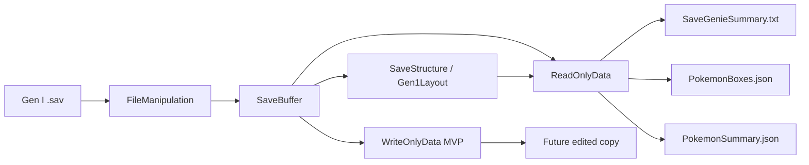

# PKMN Red Save Genie Research Document

Complete technical research record for `pkmn-red-save-genie`

Author and project lead: MAQ, Big MAQ Studio

Analysis date: 2026-06-19

## Evidence Classification Used

This document separates evidence into the following categories:

| Evidence type | Meaning |
| --- | --- |
| Confirmed by current source code | Verified by inspecting the local C++ source or headers. |
| Confirmed by Git history | Verified by local commit history. |
| Confirmed by supplied project discussion | Present in supplied Markdown, PDF text exports, or this task prompt. |
| Confirmed by external reference | Present in Bulbapedia, Glitch City Wiki, pret, or analyzed external repositories. |
| Verified against real save output | Present in generated `SaveGenieSummary.txt`, `PokemonSummary.json`, or `PokemonBoxes.json`. |
| Verified against in-game screenshot | Recorded in project brain as screenshot-validated regression data. |
| Inferred from evidence | Reasonable conclusion, but not proven directly. |
| Planned but not implemented | Roadmap or architecture direction. |
| Unknown or unverified | Needs further research or validation. |

The current repository is treated as the source of truth for implementation status. Reference PDFs, old AI conversations, external projects, and planning notes are used as research context, not as automatic code truth.

## Part I - Executive Overview

`pkmn-red-save-genie` is a C++ reverse-engineering and software engineering project created and led by MAQ of Big MAQ Studio.

MAQ is the creator and lead developer of Big MAQ Studio and the author of `pkmn-red-save-genie`, a C++ research and software engineering project focused on reverse-engineering, decoding, validating, exporting, and eventually converting Pokemon save data between Generation I and Generation III.

The current executable is called `Pkmn Red Save Genie`. The current project is primarily a Generation I save parser, validator, exporter, data-analysis engine, and future safe editor. It reads Pokemon Red/Blue/Yellow-style `.sav` data, interprets raw bytes as meaningful save fields, validates checksums, and exports both human-readable and machine-readable summaries.

The long-term project is larger: a whole-save Pokemon Red Gen I to Pokemon FireRed Gen III conversion pipeline. That future converter would take a meaningful model of a Red save and reconstruct as much of that journey as practical inside a valid FireRed save.

This is different from simply transferring one Pokemon. A Pokemon transporter only needs to convert individual Pokemon records. A whole-save converter must reason about trainer identity, party, PC boxes, Pokedex progress, inventory, badges, story state, defeated trainers, map location, target-game checksums, FireRed section rotation, and narrative consistency.

The current completed milestone, confirmed by Git history and source code, is the Gen I Save Genie reader/export foundation:

| Area | Status |
| --- | --- |
| Trainer/rival summary | Implemented |
| Money/coins/badges/playtime | Implemented |
| Location map ID/name/X/Y | Implemented |
| Main checksum and bank checksum validation | Implemented |
| Hall of Fame parsing | Implemented |
| Pokedex owned/seen parsing | Implemented |
| Bag and PC item box parsing | Implemented |
| Event flag summary | Implemented with `pret/pokered` labels, trainer rows, story categories, static battles, and gym/badge consistency |
| Party Pokemon decode | Implemented and regression-anchored |
| PC box decode/export | Implemented, still needs deeper plausibility verification |
| Move lookup | Implemented |
| JSON and text exports | Implemented |
| Safe editing layer | Conservative MVP implemented; needs broader real-save validation before release |
| Current box cache decode | Implemented and exported separately |
| World/player/daycare diagnostics | Implemented read-only with named scripts, missables, hidden items, hidden coins, visited towns, runtime fields, and Daycare |
| FireRed reader/writer | Planned but not implemented |
| Full Red to FireRed conversion | Planned but not implemented |

The project matters because it combines preservation and systems engineering. It turns fragile historical save data into readable structured records, builds safe tooling for user-owned saves, and documents a reproducible method for translating data between incompatible software generations.

## Part II - Project Origin and Motivation

### The Original Red-to-FireRed Idea

The project began from a personal preservation problem before it became a formal software-engineering and reverse-engineering project.

Based on the current supplied project-origin prompt, MAQ's uncle gifted him an original Game Boy together with the uncle's first Pokemon game, Pokemon Red. The hardware and cartridge had personal and family significance because they represented a physical piece of his uncle's gaming history. The cartridge's save battery eventually stopped functioning correctly. To preserve the game and make the cartridge usable again, MAQ repaired the hardware and restored battery-backed save functionality.

That repair process led to the central question:

```text
If an old Pokemon Red save can be recovered and preserved,
could the player's entire journey also be translated into Pokemon FireRed?
```

Pokemon FireRed is not the same binary game with new graphics. It is a Generation III remake with a different engine, save format, Pokemon structure, text encoding, event system, inventory model, and additional story content. It still represents the same broad Kanto journey. That tension produced the emotional and technical goal:

```text
Preserve the history stored in an original Pokemon Red save,
then reconstruct that history inside the newer FireRed game.
```

The intended long-term goal is to preserve as much as reasonably possible:

| Save component | Long-term conversion intent |
| --- | --- |
| Player identity | Preserve name and visible ID where practical. |
| Party and PC Pokemon | Convert to valid Gen III Pokemon records. |
| Nicknames and OT data | Normalize text safely and preserve source identity. |
| Levels, EXP, moves | Preserve or map with explicit policy. |
| Pokedex progress | Map Kanto seen/owned state. |
| Badges and money | Translate directly where possible. |
| Inventory | Map common items and report unsupported items. |
| Story milestones | Preserve only when verified and safe. |
| Defeated trainers | Map only where exact or policy-backed. |
| Player location | Use safe semantic FireRed spawn mappings. |
| FireRed-exclusive content | Preserve or initialize conservatively. |

This origin should be understood as a core research motivation, not a minor anecdote. It explains why the project is not limited to Pokemon transfer.

### Original Public Proposal

The earliest public version of the idea appeared in a Reddit discussion titled `Is it possible to export the Pokemon Red save file to FireRed, allowing you to continue your save file from Red in FireRed?` The post asked whether a Red save could be translated into FireRed so a player could continue the original journey in FireRed's newer engine, mechanics, graphics, and post-game context.

Source: https://www.reddit.com/r/GameboyAdvance/comments/1h6c5yc/is_it_possible_to_export_the_pok%C3%A9mon_red_save/

The public proposal explored two early ideas:

| Early idea | Value | Later correction |
| --- | --- | --- |
| AI-based entity mapping | Correctly recognized that conversion is semantic, not byte-for-byte. | AI should not guess undocumented offsets or event flags. The mature plan uses verified mappings. |
| Direct save-file manipulation | Correctly identified binary reading, translating, writing, and checksum repair. | The mature plan splits this into readers, models, policies, writers, validators, and reports. |

The public discussion also produced useful community feedback. One response argued that deterministic mapping is preferable to AI guessing. That direction now matches the project's mature engineering philosophy.

### Evolution Into Save Genie

The project evolved from:

```text
Can AI translate a Red save into FireRed?
```

into:

```text
1. Decode Gen I accurately.
2. Export structured Gen I data.
3. Verify party and PC data.
4. Build safe editing.
5. Decode FireRed saves.
6. Write valid FireRed saves.
7. Integrate Pokemon conversion rules.
8. Map major progress and location data.
9. Validate the result in an emulator.
```

The Save Genie was not a diversion from the converter. It became the required first stage. Before converting a save, the project must explain what every meaningful source field represents.

The Save Genie transforms raw bytes into readable facts such as:

```text
Trainer ID: 4097
Current Map: Route 1
Money: 2001
Party Count: 6
Pokemon: POLIWRATH
Level: 63
EXP: 254676
```

This gives the project an intermediate model, validation evidence, diagnostic output, JSON for future interfaces, and a standalone preservation tool.

### Development Timeline Context

The supplied project-origin prompt states that the idea began forming in 2024 and active implementation began in 2025. The local Git history confirms the current repository from February 23, 2026 onward. The beta prototype folder confirms older direct-save experiments, but the exact date of those experiments is not established by Git.

Supplied discussions mention university applications, formal study, other programming projects, game-development work, and learning more C++ and binary file manipulation. That interrupted schedule should be documented as part of a research project run by a student developer, not as project failure.

The supplied discussion archive also contains an intentionally dramatized/fake personal story used during early prompting. That material is not treated as factual biography. The true origin used here is the cartridge, battery repair, uncle's Pokemon Red, and the preservation question supplied in the current documentation prompt.

## Part III - Research Question and Project Thesis

Main research question:

```text
Can the complete meaningful state of a Pokemon Red save be decoded into a
structured intermediate representation and later reconstructed into a valid
Pokemon FireRed save while preserving player identity, Pokemon, progress,
and reasonable narrative continuity?
```

Sub-questions:

| ID | Question |
| --- | --- |
| SQ-001 | How is a Gen I save structured? |
| SQ-002 | How can every meaningful range be identified? |
| SQ-003 | How are Gen I Pokemon represented? |
| SQ-004 | Which values require endian, BCD, packed-bit, or custom text decoding? |
| SQ-005 | How can a safe editor modify data without corrupting the save? |
| SQ-006 | How is a FireRed save organized? |
| SQ-007 | How are Gen I Pokemon converted to Gen III? |
| SQ-008 | How should badges, flags, defeated trainers, items, and location be mapped? |
| SQ-009 | What should happen where no exact Gen I to Gen III equivalent exists? |
| SQ-010 | How can conversion be deterministic, testable, and documented? |

Working thesis:

```text
The source save must first be decoded into a semantic model.
Only then can safe edits or cross-generation conversion rules be applied.
```

## Part IV - Methodology

### Source Triangulation

The project combines:

| Source type | Role |
| --- | --- |
| Current C++ source | Implementation truth. |
| Git history | Milestone chronology. |
| Bulbapedia Gen I/Gen III save pages | Offset and structure reference. |
| Glitch City Wiki map index | Gen I map lookup source. |
| Species/item index references | Lookup table source material. |
| `pret/pokered` | Gen I authoritative symbols and behavior research. |
| `pret/pokefirered` | FireRed authoritative symbols and behavior research. |
| Existing save editors | Scope and UX inspiration. |
| Poke Transporter GB and PCCS | Pokemon-level conversion precedent. |
| Expert conversations | Roadmap and risk guidance. |
| Generated Save Genie exports | Current output validation evidence. |
| Save diffs and emulator screenshots | Future and existing validation method. |

### Binary Inspection Concepts

The project works with:

| Concept | Why it matters |
| --- | --- |
| Hexadecimal offsets | Save fields are stored at fixed byte addresses. |
| SRAM banks | Gen I saves are divided into four 8 KiB regions. |
| Bit flags | Badges, Pokedex, and events pack many booleans into bytes. |
| Packed nibbles | DVs and BCD values use half-byte fields. |
| Endianness | Trainer IDs, OT IDs, EXP, stats, and Stat Exp require correct byte order. |
| BCD | Money and coins store decimal digits, not normal binary integers. |
| Custom text encoding | Gen I names are not ASCII. |
| Checksums | Any edit in protected ranges must repair integrity bytes. |

### Experimental Verification

The preferred save-diff method is:

1. Copy a save.
2. Change one thing in-game.
3. Save again.
4. Compare the files.
5. Identify changed bytes.
6. Confirm with a second controlled experiment.
7. Implement minimal parser logic.
8. Compare parser output to in-game behavior.

This method appears repeatedly in expert guidance, especially from Zayaldrie, and is central for future FireRed work.

### Regression Verification

Known party Pokemon became regression anchors. The party parser was validated against screenshots according to the project brain. These values should be preserved unless stronger evidence proves a change is necessary.

### Git-Based Tracking

Reverse engineering benefits from small checkpoints. The local Git history provides a clean sequence:

| Date | Commit | Meaning |
| --- | --- | --- |
| 2026-02-23 | `cf50de7` | Initial Save Genie core. |
| 2026-02-23 | `af1d209`, `bdae805` | README and usage documentation. |
| 2026-02-24 | `8779127` | Save structure/read-only data and map names. |
| 2026-02-25 | `0ea6e66` | Hall of Fame, species lookup, map lookup, Pokedex. |
| 2026-03-03 | `daf7a21` | Bag and PC item box decoding with item lookup. |
| 2026-03-05 | `9d80ba8` | WriteOnlyData layer. |
| 2026-04-18 | `7b5c0c4` | Bug fixes. |
| 2026-04-19 | `e9e531b` | Party + boxes Pokemon decode, move lookup, JSON/text exports. |

## Part V - Technical Background: Generation I Save Data

Pokemon Red/Blue/Yellow saves are 32 KiB SRAM saves, normally `0x8000` bytes. The save is split into four 8 KiB banks:

| Bank | Range | High-level purpose |
| --- | --- | --- |
| Bank 0 | `0x0000-0x1FFF` | Scratch buffers and Hall of Fame. |
| Bank 1 | `0x2000-0x3FFF` | Main data, party, current box cache, main checksum. |
| Bank 2 | `0x4000-0x5FFF` | PC Boxes 1-6 and checksums. |
| Bank 3 | `0x6000-0x7FFF` | PC Boxes 7-12 and checksums. |

Important offsets:

| Field | Offset/range | Notes |
| --- | --- | --- |
| Player name | `0x2598` | Gen I text, 11-byte field. |
| Pokedex owned | `0x25A3`, length `0x13` | Bitset, dex order. |
| Pokedex seen | `0x25B6`, length `0x13` | Bitset, dex order. |
| Bag items | `0x25C9`, length `0x2A` | Count plus item/quantity pairs. |
| Money | `0x25F3`, length 3 | BCD. |
| Rival name | `0x25F6` | Gen I text. |
| Badges | `0x2602` | One byte bitfield. |
| Trainer ID | `0x2605` | Read big-endian by current code. |
| Current map | `0x260A` | Map ID. |
| Y coordinate | `0x260D` | Current code follows this offset. |
| X coordinate | `0x260E` | Current code follows this offset. |
| PC item box | `0x27E6`, length `0x68` | Count plus item/quantity pairs. |
| Current box number | `0x284C` | Low 7 bits box index, high bit changed-box flag in references. |
| Hall of Fame count | `0x284E` | Count hint. |
| Coins | `0x2850`, length 2 | BCD. |
| Event flags | `0x29F3`, length `0x140` | Current code summarizes raw set bits. |
| Playtime | `0x2CED-0x2CF1` | Hours, maxed, minutes, seconds, frames. |
| Party base | `0x2F2C` | Party block length `0x0194`. |
| Current box cache | `0x30C0`, length `0x0462` | Planned decode target. |
| Main checksum range | `0x2598-0x3522` | Inclusive. |
| Main checksum byte | `0x3523` | Complement of low checksum sum. |
| Boxes 1-6 | Bank 2 | `0x0462` bytes each. |
| Boxes 7-12 | Bank 3 | `0x0462` bytes each. |

Some emulator or dump files include trailing bytes, such as `0x802C`. Current behavior warns when the size is not exactly `0x8000` but can still process the first valid region if needed. A future improvement is to explicitly treat the first `0x8000` bytes as save data and warn that trailing bytes were ignored.

## Part VI - Codebase Architecture

The current project has a layered C++ architecture.



### FileManipulation

Inspected files:

| File | Role |
| --- | --- |
| `Pkmn Red Save Genie/HPP Files/FileManipulation.hpp` | Declares disk I/O helpers. |
| `Pkmn Red Save Genie/CPP Files/FileManipulation.cpp` | Implements load, write, backup, and edited path helpers. |

Confirmed behavior:

| Function | Behavior |
| --- | --- |
| `LoadFile()` | Reads an entire file into a byte vector. |
| `WriteFile()` | Writes bytes to a specified output path. |
| `BackupFile()` | Creates `(BACKUP) <filename>` and avoids overwriting an existing backup. |
| `MakeEditedPath()` | Produces `(EDITED) <filename>` without writing. |

This module intentionally has no Pokemon-specific logic.

### SaveStructure

Inspected files:

| File | Role |
| --- | --- |
| `Pkmn Red Save Genie/HPP Files/SaveStructure.hpp` | Layout constants, safe buffer API, lookup classes, codecs, checksums. |
| `Pkmn Red Save Genie/CPP Files/SaveStructure.cpp` | Implementations and lookup tables. |

Important classes:

| Class | Responsibility |
| --- | --- |
| `SaveBuffer` | Bounds-checked byte access, mutable access for writers, bit helpers, slices. |
| `Gen1Layout` | Save offsets, bank bases, party/box layout constants, checksum locations. |
| `Gen1TextCodec` | Gen I text decode/encode for names. |
| `BcdCodec` | Money and coin BCD decode/encode. |
| `Gen1Checksum` | Main, bank all, and per-box checksum compute/validate/fix. |
| `SaveValidator` | Basic size and checksum UX checks. |
| Lookup classes | Species, Pokedex, map, item, and move lookups. |

### ReadOnlyData

Inspected files:

| File | Role |
| --- | --- |
| `Pkmn Red Save Genie/HPP Files/ReadOnlyData.hpp` | Data models and reader API. |
| `Pkmn Red Save Genie/CPP Files/ReadOnlyData.cpp` | Decode implementation and summary formatting. |

Important models:

| Model | Purpose |
| --- | --- |
| `TrainerSummary` | Trainer, rival, ID, money, coins, badges, location, playtime. |
| `BagSummary`, `BagItem` | Bag and PC item box contents. |
| `PokedexSummary` | Owned/seen counts and species names. |
| `FlagSummary` | Raw event flag counts and indices. |
| `HallOfFameEntry` | Hall of Fame records. |
| `PokemonMon`, `PokemonMove`, `PokemonStats` | Party and box Pokemon. |
| `PokemonBox`, `PokemonBoxesExport` | Party as Box 0 plus PC boxes. |

Important getters:

| Getter | Status |
| --- | --- |
| `GetTrainerSummary()` | Implemented. |
| `GetBagSummary()` | Implemented. |
| `GetPCItemBoxSummary()` | Implemented. |
| `GetPokedexSummary()` | Implemented. |
| `GetEventFlagSummary()` | Implemented raw summary. |
| `GetHallOfFame()` | Implemented defensively. |
| `GetPartyAsBox0()` | Implemented. |
| `GetPCBox(int)` | Implemented. |
| `GetAllBoxesExport()` | Implemented. |
| `GetCurrentBoxCache()` | Implemented and exported separately from permanent PC boxes. |

### WriteOnlyData

Inspected files:

| File | Role |
| --- | --- |
| `Pkmn Red Save Genie/HPP Files/WriteOnlyData.hpp` | Safe editing API and request types. |
| `Pkmn Red Save Genie/CPP Files/WriteOnlyData.cpp` | Implemented MVP setters and validation. |

Current implementation:

| Feature | Status |
| --- | --- |
| Trainer/rival name setters | Implemented with validation and Gen I encoding. |
| Money/coins setters | Implemented with range validation and BCD writing. |
| Badges setter | Implemented. |
| Location setter | Implemented with map-table validation. |
| Transaction-style `Apply()` | Implemented for MVP fields, fixes main checksum. |
| Item list reading | Implemented internally. |
| Item add/remove/quantity editing | Declared but returns not implemented. |
| Pokemon editing | Placeholder returns not implemented. |
| Checksum repair | Main checksum repair implemented for MVP bank 1 edits. |

WriteOnlyData should remain conservative. Arbitrary raw offset writes are dangerous because they bypass validation and checksum logic.

### main.cpp

`main.cpp` is currently a reader/export harness:

1. Creates a backup.
2. Loads the save.
3. Wraps it in `SaveBuffer`.
4. Creates `ReadOnlyData`.
5. Emits terminal summary.
6. Writes `SaveGenieSummary.txt`.
7. Writes `PokemonBoxes.json`.
8. Writes compact `PokemonSummary.json`.

It also contains JSON helpers such as `JsonEscape()`, `WritePokemonBoxesJson()`, `WritePokemonSummaryJson()`, and `WriteSaveGenieSummaryTxt()`.

## Part VII - Implemented Save Genie Features

| Feature | Implementation | Output | Evidence | Limitation |
| --- | --- | --- | --- | --- |
| Trainer name | `GetTrainerSummary()`, `Gen1TextCodec::DecodeName()` at `0x2598` | Summary and JSON | Code and generated output | Text codec partial. |
| Rival name | `GetTrainerSummary()` at `0x25F6` | Summary | Code and output | Text codec partial. |
| Trainer ID | Big-endian read at `0x2605` | Summary and JSON | Code and Pidgey anchor | Must preserve endian. |
| Money | `BcdCodec::ReadBcd3()` at `0x25F3` | Summary | Code and output | Invalid BCD nibbles currently collapse to 0 digit. |
| Coins | `BcdCodec::ReadBcd2()` at `0x2850` | Summary | Code and output | Same BCD caveat. |
| Badges | Bitfield at `0x2602` | Summary list | Code and output | Output order should be validated against current tested behavior. |
| Location | Map ID/name and X/Y | Summary | Code and output | Exact map state has more fields than map/x/y. |
| Playtime | Hours/min/sec | Summary | Code and output | Frames and maxed flag not fully exported. |
| Main checksum | `Gen1Checksum::ValidateMain()` | Summary | Code and output | Size mismatch can still warn. |
| Bank checksums | `ValidateBankAll()` | Summary | Code and output | Per-box checksum validation exists but not printed in summary. |
| Hall of Fame | `GetHallOfFame()` | Summary | Code and output | Defensive heuristics may skip unusual records. |
| Pokedex | `GetPokedexSummary()` | Summary | Code and output | Names depend on lookup table. |
| Bag items | `GetBagSummary()` | Summary | Code | Safe quantity editing future. |
| PC item box | `GetPCItemBoxSummary()` | Summary | Code | Safe quantity editing future. |
| Event flags | `GetEventFlagSummary()` | Summary | Code | Raw indices only, no names. |
| Party | `GetPartyAsBox0()` | Summary and JSON | Code, output, screenshot anchors | Do not change offsets casually. |
| PC boxes | `GetPCBox()` | JSON and stats | Code and output | Boxed level plausibility needs verification. |
| Move lookup | `Gen1MoveLookup::MoveFromId()` | Summary and JSON | Code and output | Base PP/PP Ups future. |
| JSON exports | `main.cpp` writers | `PokemonBoxes.json`, `PokemonSummary.json` | Code and output | Summary JSON intentionally compact. |
| Text export | `WriteSaveGenieSummaryTxt()` | `SaveGenieSummary.txt` | Code and output | Generated artifact, not committed. |

## Part VIII - Pokemon Party and Box Research

### Party Layout

Party base is `0x2F2C`, block size `0x0194`, maximum party size 6.

| Relative offset | Meaning |
| --- | --- |
| `+0x00` | Party count. |
| `+0x01` | Species list, 6 bytes. |
| `+0x07` | Padding/terminator area. |
| `+0x08` | Six party Pokemon structs, `0x2C` bytes each. |
| `+0x110` | OT names, six `0x0B` fields. |
| `+0x152` | Nicknames, six `0x0B` fields. |

Party struct decode in current code:

| Struct offset | Meaning |
| --- | --- |
| `+0x00` | Species. |
| `+0x01` | Current HP, big-endian. |
| `+0x04` | Status. |
| `+0x08..+0x0B` | Move IDs. |
| `+0x0C..+0x0D` | OT ID, big-endian. |
| `+0x0E..+0x10` | EXP, 3-byte big-endian. |
| `+0x11..+0x1A` | Stat Exp, big-endian pairs. |
| `+0x1B..+0x1C` | Packed DVs. |
| `+0x1D..+0x20` | PP bytes. |
| `+0x21` | Level in current implementation. |
| `+0x22..+0x2B` | Max HP, Attack, Defense, Speed, Special. |

The current implementation masks PP bytes with `rawPP & 0x3F`, because low 6 bits are current PP and high 2 bits are PP Ups. `ppMax` is intentionally a placeholder equal to current PP.

DV packing:

```cpp
atkDV = high nibble of byte 1
defDV = low nibble of byte 1
spdDV = high nibble of byte 2
spcDV = low nibble of byte 2
hpDV = ((atkDV & 1) << 3) |
       ((defDV & 1) << 2) |
       ((spdDV & 1) << 1) |
       ((spcDV & 1) << 0)
```

### Box Layout

Each PC box block is `0x0462` bytes and stores up to 20 Pokemon.

| Relative offset | Meaning |
| --- | --- |
| `+0x0000` | Box count. |
| `+0x0001` | Species list, 20 bytes. |
| `+0x0015` | Padding/terminator area. |
| `+0x0016` | Twenty boxed Pokemon structs, `0x21` bytes each. |
| `+0x02AA` | OT names. |
| `+0x0386` | Nicknames. |

Party and boxed Pokemon differ. Party Pokemon store live battle stats. Boxed Pokemon do not store the same visible stats, so zeros in boxed stats are not automatically parser failures.

Current verification warning: `PokemonBoxes.json` in the reference folder shows several boxed Pokemon levels above 100. The source code also contains a code/comment mismatch around boxed level reading: the comment notes many tools treat boxed level as `+0x03`, while the code reads `monOff + 0x21` after requiring a `0x21`-byte struct. Because the project rule is not to change tested behavior during documentation, this is recorded as a verification gap, not edited here.

### Regression Anchors

The project brain records party values validated against real screenshots:

| Pokemon | Internal ID | Dex | Level | EXP | HP | ATK | DEF | SPD | SPC | Moves |
| --- | --- | --- | --- | --- | --- | --- | --- | --- | --- | --- |
| POLIWRATH | 111 | 62 | 63 | 254676 | 195/205 | 148 | 161 | 131 | 123 | STRENGTH, SURF, EARTHQUAKE, HYPNOSIS |
| ALAKAZAM | 149 | 65 | 62 | 238401 | 173/173 | 85 | 87 | 184 | 209 | RECOVER, PSYCHIC, FLASH, THUNDER WAVE |
| ARTICUNO | 74 | 144 | 61 | 293952 | 197/197 | 132 | 143 | 122 | 183 | REFLECT, ICE BEAM, FLY, REST |
| MEWTWO | 131 | 150 | 83 | 731123 | 309/309 | 227 | 200 | 247 | 302 | THUNDERBOLT, PSYCHIC, ICE BEAM, RECOVER |
| GOLEM | 49 | 76 | 50 | 118063 | 164/164 | 139 | 151 | 73 | 85 | BIDE, MEGA PUNCH, DIG, ROCK THROW |
| PIDGEY / PEGGY | 36 | 16 | 3 | 57 | 15/15 | 8 | 7 | 8 | 7 | GUST |

PEGGY is especially valuable because it is a normal low-level legitimate Pidgey with nickname `PEGGY`, OT `MARIO`, OT ID `4097`, zero Stat Exp, and a simple moveset. It validates nickname decoding, OT decoding, OT ID endian handling, low-level stats, and Stat Exp zero handling.

Unknown glyphs such as `BRU?O` and `78??` do not necessarily mean an offset is wrong. They may reflect hacked/modded text bytes or unsupported glyphs in the current text codec. PEGGY/MARIO proves that ordinary text fields can decode correctly.

## Part IX - JSON and Data Export Design

The project exports three runtime artifacts:

| File | Audience | Purpose |
| --- | --- | --- |
| `PokemonBoxes.json` | Machine-readable research/export tooling | Full detailed Pokemon export: party as Box 0 plus PC Boxes 1-12. |
| `PokemonSummary.json` | Future UI/dashboard | Compact file, checksum, party, and PC box count summary. |
| `SaveGenieSummary.txt` | Human reviewer/debugger | Terminal-style full diagnostic report. |

JSON export is useful for:

| Use case | Value |
| --- | --- |
| Web frontend | A future browser UI can consume compact and full JSON. |
| Regression snapshots | Schema and value changes can be diffed. |
| Conversion adapter | Pokemon and trainer fields can feed a structured intermediate model. |
| Research analysis | Human-readable output helps verify offsets and assumptions. |
| External tooling | Stable fields make downstream scripts possible. |

`JsonEscape()` in `main.cpp` escapes quotes, backslashes, control characters, and common JSON special characters. JSON output must remain valid and stable.

## Part X - Problems Encountered and Lessons Learned

| Problem | Symptom | Incorrect assumption | Correction | Validation | Lesson |
| --- | --- | --- | --- | --- | --- |
| Endianness errors | IDs/stats decode as implausible values. | Assume little-endian because many systems use it. | Read Trainer ID, OT ID, Stat Exp, EXP, and visible stats with correct endian per field. | Party anchors and PEGGY OT ID. | Endian must be verified field-by-field. |
| Party stat offsets | Stats did not match screenshots. | Follow a table blindly. | Use implementation offsets validated against game screenshots. | POLIWRATH, ALAKAZAM, ARTICUNO, MEWTWO, GOLEM, PEGGY. | Tested output beats unverified references. |
| Text encoding | Names render as symbols or `?`. | Treat Gen I text as ASCII. | Implement Gen I byte-to-character mapping and terminator handling. | PEGGY/MARIO and decoded party names. | Custom encodings need codecs, not string casts. |
| Save-size assumptions | Some saves are `0x802C`, not exactly `0x8000`. | Reject non-`0x8000` outright. | Warn while preserving support for valid first `0x8000` bytes. | Generated output shows size `0x802c` with valid checksum. | Emulators may append metadata/trailing bytes. |
| PP representation | Max/current PP not fully known. | Treat PP byte as raw current PP. | Mask low six bits; leave base PP + PP Ups for future. | Party move PP output. | Packed fields need staged decoding. |
| Party vs box confusion | Boxed Pokemon stats show zeros. | Assume boxes store live stats like party. | Leave boxed visible stats zero unless computed later. | Code and project brain. | Data absence is not always parser failure. |
| Text intermediate layer | Early plan suggested text-driven conversion. | Text export could simplify binary reconstruction. | Treat text as audit/debug output, not source of truth. | Planning PDF correction. | Structured models should drive conversion. |
| AI limitations | Early proposal emphasized AI mapping. | AI can infer flags/offsets safely. | Use AI for repetitive coding/docs, not as authority. | Expert guidance and project brain. | Binary truth must come from code, refs, diffs, and screenshots. |
| Documentation contradictions | PDFs, wikis, and code can disagree. | A reference table is automatically correct. | Cross-check with current source and tested output. | Party offset warnings. | Reverse engineering requires triangulation. |

## Part XI - Expert and Community Consultation

### The Gears of Progress

MAQ contacted The Gears of Progress because of their experience with Pokemon restoration/transfer work, Poke Transporter GB, and the Pokemon Community Conversion Standard ecosystem. Their advice shaped the project roadmap.

Key advice, paraphrased from supplied discussions:

| Advice | Influence on project |
| --- | --- |
| Break the large problem into small pieces. | Save Genie became the first stage instead of attempting FireRed output immediately. |
| Build generalized Gen I and Gen III readers/writers first. | Roadmap separates Gen I reader, FireRed reader/writer, and conversion layer. |
| Separate Pokemon, flags/progression, and location. | Converter roadmap is divided into solvable domains. |
| Use decompilations and symbol lists for flags. | Future event/trainer flag work points to `pret/pokered` and `pret/pokefirered`. |
| Do not depend on AI guessing for GB/GBA internals. | Documentation emphasizes verification and deterministic mapping. |
| Document everything. | Project brain, inspiration map, external analysis, and this research document exist to preserve findings. |
| Use AI for repetitive coding/data work, not final authority. | Codex tasks are scoped and reference-driven. |

Timeline evidence from the inspiration file records advice dates including July 31, 2025; August 20, 2025; September 30/October 1, 2025; October 13, 2025; January 7-8, 2026; February 14, 2026; March 26, 2026; and April 19, 2026.

### Zayaldrie

MAQ contacted Zayaldrie because of direct experience with Gen III save manipulation tools/libraries and FireRed-style save sections.

Key advice:

| Advice | Influence |
| --- | --- |
| Initial location mapping can use Gen I map ID to known-good Gen III map/x/y. | Future location conversion should start with safe spawn tables. |
| Exact tile coordinate preservation is unnecessary initially. | MVP should prefer safe continuity over precision. |
| Save diffs are essential. | FireRed research plan begins with controlled before/after saves. |
| Gen III sections need to be split and understood. | Future FireRed reader starts with section container logic. |
| Flags are harder than coordinates. | Story/progress mapping is placed after Gen I flag labeling. |
| Tool language does not need to match the game language. | C++ remains valid for save byte manipulation. |
| Sevii Islands can create inconsistent converted saves. | Future converter should start conservative around postgame and islands. |

### Other Community Sources

| Source | Influence |
| --- | --- |
| `pret/pokered` contributors | Authoritative Gen I symbol and save behavior source. |
| `pret/pokefirered` contributors | Authoritative FireRed symbol and save behavior source. |
| Existing editor authors | Scope, UI, and safe-editing inspiration. |
| Poke Transporter GB | Proof that Pokemon-level Gen I/II to Gen III transfer is possible. |
| PCCS | Possible future Pokemon conversion policy/library. |
| Game Tools Collection | Browser-local save editing workflow inspiration. |
| Reddit community discussion | Early feedback that deterministic mapping is preferable to AI guessing. |

This document does not imply personal consultation where only source-code research occurred.

## Part XII - External Projects and Comparative Analysis

The detailed code-level analysis lives in `docs/external_projects_deep_analysis.md`. Summary:

| Project | What it solves | What it does not solve |
| --- | --- | --- |
| `junebug12851/pokered-save-editor` | Broad Gen I Red/Blue editor, Angular/Electron UI, current-box overlay, checksums. | Not a Red to FireRed whole-save converter. |
| Game Tools Collection | Browser-local save editing, declarative schemas, Red/Blue/Yellow variants. | Not a C++ core or whole-save converter. |
| Pokemon Community Conversion Standard | Pokemon-level Gen I/II to Gen III conversion policies and code. | Not full save conversion; license unclear in inspected clone. |
| Poke Transporter GB | Hardware Pokemon transporter using PCCS and Gen III save-sector writes. | Not a generic desktop whole-save `.sav` converter. |
| `pret/pokered` | Authoritative Gen I disassembly symbols. | Not an editor or converter. |
| `pret/pokefirered` | Authoritative FireRed decompilation symbols. | Not an editor or converter. |

Crucial distinction:

```text
Existing tools may edit Gen I saves or transfer individual Pokemon.
That is not the same as full Red to FireRed whole-save conversion.
```

Careful wording:

```text
Among the analyzed projects, none was found to provide the complete
whole-save conversion pipeline targeted by this project.
```

## Part XIII - Why Existing Projects Do Not Replace This Project

The unique combination of goals is:

```text
Gen I parser
+ data analysis
+ structured JSON export
+ safe editor
+ C++ core
+ future WebAssembly frontend
+ Pokemon conversion standard integration
+ FireRed save writer
+ whole-save mapping
+ documentation-first research
```

Originality is not based on being the first Gen I save editor. The distinct direction is the transition from:

```text
raw Gen I save
-> structured semantic model
-> safe editing
-> conversion adapter
-> valid FireRed save reconstruction
```

## Part XIV - Future Gen III / FireRed Research

FireRed save support is planned but not implemented.

High-level Gen III save architecture:

| Concept | Meaning |
| --- | --- |
| 128 KiB save | FireRed `.sav` is much larger than Gen I. |
| Save A and Save B | Two redundant game save blocks. |
| 14 sections per block | Each save block is split into section IDs 0-13. |
| Section rotation | Physical order rotates, so code must map by section ID. |
| Signature | Sections contain a magic signature. |
| Checksum | Each section validates its own payload. |
| Save index | Used to select newest valid save block. |
| Trainer section | Holds name, gender, trainer ID, playtime, security key. |
| Team/items section | Holds party and item data. |
| PC buffer sections | Hold Pokemon storage. |
| Encrypted Pokemon structures | Gen III Pokemon data requires PID-based decryption and substructure ordering. |

First safe FireRed milestones:

1. Load a FireRed save.
2. Identify active save block.
3. Split sections.
4. Validate signatures.
5. Validate checksums.
6. Read trainer name and trainer ID.
7. Read party count.
8. Export a FireRed summary.
9. Perform unchanged round-trip write.
10. Modify one harmless SaveBlock2 field such as player name.
11. Repair checksum.
12. Confirm emulator loads the save.

## Part XV - Future Pokemon Conversion Layer

Current `PokemonMon` data can become conversion input:

| Current Gen I field | Future use |
| --- | --- |
| Species internal ID/dex number | Map to Gen III species. |
| Nickname and OT name | Normalize to Gen III text encoding. |
| OT ID | Preserve visible identity or feed deterministic policy. |
| Level and EXP | Copy or recompute according to growth policy. |
| Moves | Map Gen I move IDs to Gen III move IDs. |
| PP current | Preserve current PP or recompute from base PP/PP Ups. |
| DVs | Convert to IVs by chosen policy. |
| Stat Exp | Convert to legal EVs by chosen policy. |
| Party HP/status | Reset or preserve by explicit policy. |

Open policy areas:

| Field | Policy needed |
| --- | --- |
| PID/personality | Deterministic generation. |
| Nature | Derived from source data or policy. |
| Gender | Species/gender ratio plus PID constraints. |
| Ability | Species-appropriate, deterministic. |
| Friendship | Default or source-derived if possible. |
| Held item | Usually none or mapped special cases. |
| Met data | FireRed-compatible location/level/origin. |
| EVs | Legal cap and distribution from Stat Exp. |
| Glitch Pokemon | Reject, sanitize, or map with report. |
| Legality vs faithfulness | User-visible conversion mode. |

PCCS may help, but integration should wait for license clarity and a deliberate policy decision.

## Part XVI - Flags, Story State, and Location Mapping

Flags and story state are likely the hardest part of whole-save conversion.

Areas involved:

| Area | Challenge |
| --- | --- |
| Badges | Easy byte field in Gen I, but FireRed story effects may need additional flags. |
| Defeated trainers | Requires Gen I event names and FireRed equivalent state. |
| Item pickups | Many map-specific flags. |
| NPC gifts | Often one-time flags with different scripts across games. |
| Completed scripts | Not one-to-one between Red and FireRed. |
| Hidden items | Bitsets differ. |
| Missable objects | Map object visibility state differs. |
| Major story events | Rockets, Silph, fossils, Elite Four, starters, etc. |
| Sevii Islands | FireRed-exclusive progression intersects pre/post Cinnabar and postgame. |

Possible policies:

| Policy | Description | Risk |
| --- | --- | --- |
| Faithful-progress policy | Map as much Gen I progress as possible. | High, requires exhaustive flags. |
| Conservative safe-state policy | Preserve trainer and Pokemon, set FireRed to a known safe state. | Lower, but less narrative preservation. |
| Hybrid policy | Preserve major milestones while leaving ambiguous flags unset. | Medium, needs explicit report. |

Recommended first policy: conservative/hybrid. Do not pretend every flag is understood.

Safe location mapping:

```text
Gen I map ID
-> semantic location
-> known-good FireRed map group/map ID/warp/x/y
```

## Part XVII - Safe Editor Research

Future WriteOnlyData MVP should focus on:

| Edit target | Status |
| --- | --- |
| Money | Setter implemented. |
| Coins | Setter implemented. |
| Trainer name | Setter implemented. |
| Rival name | Setter implemented. |
| Badges | Setter implemented. |
| Location | Setter implemented, should be used carefully. |
| Bag quantities | Planned; item write methods not implemented. |
| PC item quantities | Planned; item write methods not implemented. |

Safe editing rules:

1. Never overwrite original directly.
2. Create backup first.
3. Write edited copy.
4. Validate all input.
5. Use correct text encoding.
6. Repair checksums.
7. Re-read edited output.
8. Emit change report.
9. Reject invalid ranges.

Pokemon editing is more dangerous because species, moves, PP, EXP, DVs, Stat Exp, party stats, box checksums, and legal value interactions must all remain coherent.

## Part XVIII - Testing and Validation Strategy

Unit tests:

| Test | Purpose |
| --- | --- |
| Endian readers | Prevent ID/stat decode regressions. |
| BCD | Verify money/coins. |
| Text codec | Verify Gen I names and terminators. |
| Checksum calculation | Main, bank, and per-box checksum correctness. |
| DV unpacking | Verify packed nibbles and HP DV formula. |
| PP masking | Verify low 6 bits only. |
| JSON escaping | Prevent invalid exports. |

Synthetic fixtures should use generated byte arrays rather than copyrighted saves.

Regression data should use known decoded values from verified test saves without committing private saves.

Round-trip tests for future writable fields:

```text
decode
-> edit
-> encode
-> decode again
-> compare
```

Malformed input tests:

| Input | Expected behavior |
| --- | --- |
| Short file | Bounds-safe error. |
| Oversized/trailing file | Warn or parse first valid region by policy. |
| Invalid counts | Clamp safely. |
| Unknown species | Return safe placeholder. |
| Corrupt checksums | Report invalid. |
| Invalid terminators | Decode defensively. |
| Impossible item quantities | Validate/reject on write. |

Emulator loading remains the final integration check for edited and converted saves.

## Part XIX - Ethics, Preservation, and Legal Boundaries

The project should not distribute:

| Do not distribute | Reason |
| --- | --- |
| Pokemon ROM files | Copyrighted game assets/code. |
| Copyrighted game assets | Not needed for save research. |
| Private user saves | Personal data/history. |
| Proprietary Nintendo code | Legal and ethical boundary. |

The project may provide:

| Can provide | Reason |
| --- | --- |
| Original source code | Project-authored tooling. |
| Save structure research | Format documentation. |
| Offset tables where legally appropriate | Interoperability research. |
| User-provided save manipulation | Users provide their own data. |
| Conversion algorithms | Original implementation. |
| Synthetic-data tests | Copyright-safe validation. |

Preservation value:

1. Understand aging cartridge saves.
2. Export readable data.
3. Create backups.
4. Document formats.
5. Help users preserve their own game history.
6. Support future migration of historical save data.

## Part XX - Current Status and Roadmap

Current completed milestone:

```text
Gen I Save Genie reader/export foundation with party and PC box decoding.
```

Roadmap:

| Stage | Goal | Dependencies | Risks | Validation | Completion criteria |
| --- | --- | --- | --- | --- | --- |
| 1. Real-save validation pass | Validate PC boxes, current box cache, named event/world rows, and Safe Editor output against controlled saves/save diffs. | Current parser/export/tests. | Mistaking runtime cache bytes for stable state. | Emulator screenshots, byte diffs, decoded output comparison. | Confirmed real-save evidence for release-critical rows. |
| 2. Text/validation polish | Improve unsupported-character reporting and malformed-save diagnostics. | Safe Editor and parser tests. | Silent lossy text handling. | Synthetic malformed fixtures and editor input tests. | Clear errors without crashes or silent replacement. |
| 3. Freeze export schemas | Stabilize `PokemonBoxes.json`, `PokemonSummary.json`, `SaveGenieSummary.txt`, and future `.red.json` direction. | Current richer exports. | Summary bloat and schema churn. | JSON validation and snapshot review. | Documented schema version/field meanings. |
| 4. Public Gen I release prep | Finish README, release checklist, limitations, generated-output docs, and no-ROM/no-save policy. | Release docs. | Overclaiming region/version support. | Manual release checklist. | First public Save Genie release candidate. |
| 5. FireRed reader | Parse sections and trainer summary. | Gen III research. | Section rotation/save index. | Synthetic and real test saves. | Valid section map and summary. |
| 6. FireRed writer | Unchanged round-trip then safe field edit. | Reader/checksum tests. | Corrupting active slot. | Emulator load. | Valid copied save. |
| 7. Pokemon conversion adapter | Convert `PokemonMon` to Gen III Pokemon. | Gen III Pokemon codec and policy. | Legality/policy ambiguity. | Deterministic tests. | Reported conversion output. |
| 8. Limited whole-save proof | Produce safe FireRed save from Red model. | All above. | Flags/location/story. | Emulator load and report. | Playable MVP with conservative policy. |
| 11. Expand flags/location | Improve narrative continuity. | Extensive diffs and decomp research. | Sevii/postgame inconsistency. | Scenario tests. | Documented mapping coverage. |

## Part XXI - Research Findings

| Finding | Evidence | Implication | Implementation consequence | Remaining uncertainty |
| --- | --- | --- | --- | --- |
| Gen I internal species IDs do not equal Pokedex numbers. | Bulbapedia species index and lookup code. | Need species-to-dex mapping. | `Gen1SpeciesLookup` has internal ID and `PokeDex` mapping. | Glitch species policy future. |
| Party and boxed Pokemon structures differ. | Gen I references and code. | Boxed stats may be zero. | Separate decode helpers. | Boxed level offset needs verification. |
| Party Pokemon store visible stats. | Code and screenshot anchors. | Party stats can be exported directly. | `PokemonStats` populated for party. | Do not change offsets casually. |
| Gen I uses proprietary text encoding. | Gen I save refs and codec code. | ASCII assumptions fail. | `Gen1TextCodec`. | Full glyph coverage future. |
| PP bytes contain PP Ups in upper bits. | Project brain and code. | Current PP must be masked. | `rawPP & 0x3F`. | Base PP + PP Ups future. |
| Current box cache is separate from permanent boxes. | Bulbapedia, `pret/pokered`, external analysis, constants. | Must decode cache separately. | Constants exist, getter future. | Which copy is authoritative in edge cases. |
| Emulator saves may contain trailing bytes. | Generated output size `0x802c`. | Strict `0x8000` rejection would be too harsh. | Warn currently. | Formal trailing-byte policy future. |
| Gen III saves are sectioned and redundant. | Bulbapedia Gen III and external analysis. | FireRed reader must select latest sections. | Future `Gen3SaveContainer`. | Exact FRLG edge cases. |
| Location conversion is easier than full event conversion. | Zayaldrie advice. | Use safe spawn mapping first. | Future `LocationConversionMap`. | Extra location variables. |
| Full flag mapping is central difficulty. | Gears/Zayaldrie advice and save refs. | Do not start with perfect story conversion. | Future `ProgressConversionMap`. | Many flag equivalents. |
| Pokemon-level transfer is partly solved by community projects. | PCCS and Poke Transporter GB analysis. | Reuse concepts/policies. | Future adapter. | PCCS license/policy. |
| Whole-save reconstruction is separate from Pokemon transfer. | External analysis. | Save writer and progress mapping still required. | Long-term architecture. | No analyzed full solution. |

## Part XXII - Open Research Questions

| ID | Question |
| --- | --- |
| Q-FLAG-001 | Which Gen I event flags correspond to every defeated trainer? |
| Q-FLAG-002 | Which FireRed flags correspond to those events? |
| Q-FLAG-003 | Which Gen I story milestones have no exact FireRed equivalent? |
| Q-GEN3-001 | Which FireRed flags are necessary for a stable post-League save? |
| Q-GEN3-002 | How should Sevii Islands progress be initialized? |
| Q-LOC-001 | What location variables beyond map/x/y must be written? |
| Q-CONV-001 | How should Stat Exp become legal EVs? |
| Q-CONV-002 | How should DVs become IVs? |
| Q-CONV-003 | Which conversion policy should be default? |
| Q-CONV-004 | How should glitch Pokemon be handled? |
| Q-GEN1-001 | How should unsupported Gen I text be normalized? |
| Q-GEN1-002 | How should regional save differences be detected? |
| Q-GEN1-003 | Should current box cache or permanent box copy be considered authoritative? |
| Q-GEN3-003 | What is the safest first FireRed write operation? |
| Q-REPORT-001 | How should conversion decisions be reported to users? |
| Q-GEN1-004 | Why do some current generated PC box levels appear above 100, and is the boxed level offset correct? |

## Part XXIII - Reproducibility Guide

Tools:

| Tool | Use |
| --- | --- |
| Xcode or C++17 compiler | Build current project. |
| Hex editor | Inspect offsets and save diffs. |
| Emulator | Create controlled saves and validate edited output. |
| Git | Track milestones and isolate experiments. |
| Markdown editor | Maintain research notes. |
| Optional JSON tooling | Validate generated JSON. |

Build process:

```bash
g++ -std=c++17 "Pkmn Red Save Genie/CPP Files/"*.cpp -I"Pkmn Red Save Genie/HPP Files" -o SaveGenie
```

The README also documents building via the included Xcode project.

Run process:

1. Provide a legally obtained `.sav` in the executable directory or update `inputPath` in `main.cpp`.
2. Run the executable.
3. Inspect terminal output.
4. Inspect `SaveGenieSummary.txt`.
5. Validate `PokemonBoxes.json`.
6. Validate `PokemonSummary.json`.

Save-diff workflow:

1. Create baseline save copy.
2. Change one controlled in-game value.
3. Save again.
4. Compare binary files.
5. Record offset/range/endian/bit behavior.
6. Implement minimal parser/writer logic.
7. Re-run and compare output.
8. Commit only after validation.

Do not include ROMs or private saves in the repository.

## Part XXIV - Research Timeline

| Date or period | Milestone | Evidence |
| --- | --- | --- |
| 2024 | Original public Red-to-FireRed idea began forming. | Reddit URL and current supplied origin prompt. |
| 2025 | Active implementation began according to supplied prompt. | Current supplied origin prompt; exact local Git evidence begins later. |
| May 2025 | Supplied discussion mentions MAQ travel/Boston/Harvard summer school context. | `Save Data Converter Project with Save Ginie git .txt`; not enough to claim a specific C++ course. |
| July 31, 2025 | Gears recommended written questions over voice for precision. | Inspiration timeline. |
| August 20, 2025 | Gears advised generalized Gen I/Gen III readers/writers first. | Inspiration timeline. |
| September 30 / October 1, 2025 | Gears encouraged small-step approach. | Inspiration timeline. |
| October 5-6, 2025 | Zayaldrie advised safe map mapping and warned flags are harder. | Inspiration timeline. |
| October 13, 2025 | Gears announced first PCCS version. | Inspiration timeline. |
| January 7-8, 2026 | Plan clarified around decompiled games, save analysis, readable data, then matching. | Inspiration timeline. |
| February 14, 2026 | Discussion about official FireRed release/remake and save data uncertainty. | Inspiration timeline. |
| February 23, 2026 | Current repository initial Save Genie core. | Git commit `cf50de7`. |
| February 24, 2026 | Save structure/read-only data and map names added. | Git commit `8779127`. |
| February 25, 2026 | Hall of Fame, species lookup, map lookup, Pokedex decode. | Git commit `0ea6e66`. |
| March 3, 2026 | Bag and PC item decoding with Gen I item lookup. | Git commit `daf7a21`. |
| March 5, 2026 | WriteOnlyData layer added. | Git commit `9d80ba8`. |
| March 26, 2026 | Gears advised AI is useful for mechanics but unreliable for niche internals. | Inspiration timeline. |
| April 19, 2026 | Full Gen I Pokemon decode foundation: party, PC boxes, move lookup, JSON/text exports. | Git commit `e9e531b`; project brain. |
| April 19, 2026 | Gears recommended FRLG symbol list for flag information after box decode milestone. | Inspiration timeline. |
| Next | Verify PC box decode and add current box cache. | Project brain roadmap and this research pass. |

## Part XXV - Conclusion

`pkmn-red-save-genie` is already a meaningful standalone result: a C++ Gen I save reader/exporter that decodes major Pokemon Red save structures into readable summaries and JSON. It is also the source-side foundation for a larger Red to FireRed whole-save conversion pipeline.

The project is strongest when it follows the discipline that emerged from its research:

| Principle | Meaning |
| --- | --- |
| Incremental engineering | Build readers, exports, writers, and converters in small verified stages. |
| Verified reverse engineering | Trust current tested code and real output over unsupported assumptions. |
| Community collaboration | Use expert advice and external projects without pretending they solve everything. |
| Transparent documentation | Record offsets, failures, corrections, and open questions. |
| Safe save handling | Never overwrite original saves and repair checksums after edits. |
| Preservation value | Treat user saves as historical personal data worth understanding and protecting. |

The long-term converter appears feasible in pieces, but the hard parts remain: named flags, story-state mapping, FireRed save writing, Gen III Pokemon encoding, and Sevii/postgame consistency. The right path remains:

```text
Small verified steps. No blind guesses. Preserve the save.
```
