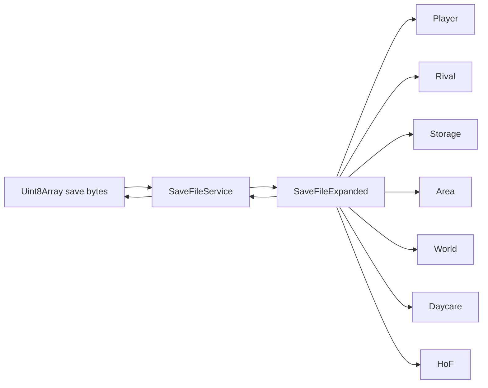
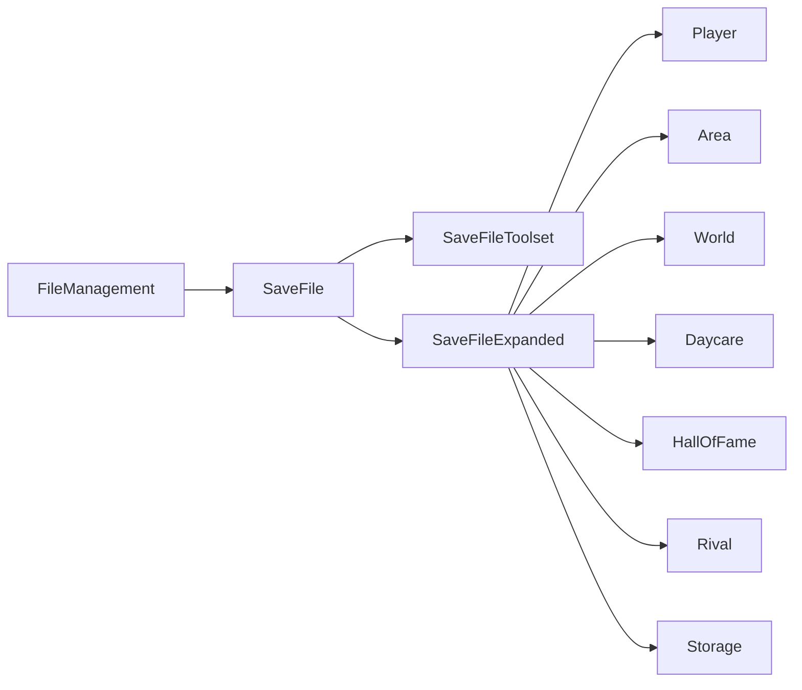

# Junebug Save Editors Analysis Findings

Date of analysis: 2026-06-20
Prepared for: `pkmn-red-save-genie` by MAQ / BiG MAQ Studios
Local project status used for comparison: uncommitted Save Genie release-prep branch state after Safe Editor MVP, Current Box Cache, event-label, test, and release-doc work.

## Executive Summary

This report analyzes two Junebug repositories as source-code references for completing the Gen I Save Genie release:

- `junebug12851/pokered-save-editor`
- `junebug12851/pokered-save-editor-2`

Both projects are confirmed source-code implementations of Pokémon Red/Blue save editing, not Red-to-FireRed save converters. They are useful for Gen I save coverage, editor UX, offset verification, and test strategy. They do not replace `pkmn-red-save-genie` because Save Genie has a different purpose: a C++ command-line save reader/exporter/safe editor foundation that will later become the source-side model for a whole-save Red-to-FireRed conversion pipeline.

Most important findings:

- Both Junebug editors support a broad expanded save model, including trainer data, Pokémon, PC boxes, Pokédex, items, Hall of Fame, world/event structures, and map/area state.
- Both editors treat the current PC box cache at `0x30C0` as the active version of the selected box, while permanent box storage may be stale until an in-game box switch.
- Both editors write badge bits to two offsets, `0x2602` and `0x29D6`. Save Genie should verify whether its current badge editor should update both fields before final release.
- `pokered-save-editor-2` has the strongest test architecture: synthetic fixtures, byte-stability round trips, malformed-input tests, and byte-difference checks.
- `pokered-save-editor` version 1 has very broad editable Gen I coverage, but its whole-expanded-section save workflow is less conservative than Save Genie’s Safe Editor MVP.
- `pokered-save-editor-2` source currently contains an inspected-code risk in `SaveFileToolset::recalcBoxesChecksums()`: the Bank 3 individual checksum values appear to be appended to the Bank 2 vector while the Bank 3 vector is copied empty. This may be unused by the main save path or covered elsewhere, but it should not be copied without verification.
- Both repos are Apache-2.0 licensed. Code can likely be reused with license compliance and attribution, but Save Genie should prefer independent implementation and treat Junebug as inspiration/reference unless a deliberate copied-code decision is made.

## Methodology

I inspected actual source files, not only README files. The repositories were cloned into a temporary local workspace outside this repository for inspection.

Inspected repository commits:

| Project | Repository | Inspected commit | Commit date | Commit message |
|---|---|---:|---|---|
| `pokered-save-editor` | `https://github.com/junebug12851/pokered-save-editor` | `b387f34ef20f311d5ef55ba181047357821b56d2` | 2019-03-31 | `Merge branch 'master' of github.com:junebug12851/pokered-save-editor` |
| `pokered-save-editor-2` | `https://github.com/junebug12851/pokered-save-editor-2` | `8f3aea2269e5067c3dae21ce0490540571467fa7` | 2026-06-17 | `feat(editor): move action groups into the tab header bar` |

Repository-relative source paths inspected include:

- `pokered-save-editor/src/app/data/savefile.service.ts`
- `pokered-save-editor/src/app/data/savefile-expanded/SaveFileExpanded.ts`
- `pokered-save-editor/src/app/data/savefile-expanded/sections/Storage.ts`
- `pokered-save-editor/src/app/data/savefile-expanded/fragments/PokemonBox.ts`
- `pokered-save-editor/src/app/data/savefile-expanded/fragments/PokemonParty.ts`
- `pokered-save-editor/src/app/data/savefile-expanded/sections/Player/PlayerBasics.ts`
- `pokered-save-editor/src/app/data/savefile-expanded/sections/Player/PlayerItems.ts`
- `pokered-save-editor/src/app/data/savefile-expanded/sections/Player/PlayerPokedex.ts`
- `pokered-save-editor/src/app/data/savefile-expanded/sections/Rival.ts`
- `pokered-save-editor/src/app/data/savefile-expanded/sections/HoF.ts`
- `pokered-save-editor/src/app/data/savefile-expanded/fragments/HoFRecord.ts`
- `pokered-save-editor/src/app/data/savefile-expanded/fragments/HoFPokemon.ts`
- `pokered-save-editor/src/app/data/savefile-expanded/sections/World/WorldEvents.ts`
- `pokered-save-editor/src/app/data/savefile-expanded/sections/World/WorldScripts.ts`
- `pokered-save-editor/src/app/data/text.service.ts`
- `pokered-save-editor/electron/SaveFile.js`
- `pokered-save-editor-2/assets/saves/structure.md`
- `pokered-save-editor-2/projects/savefile/src/pse-savefile/savefile.h`
- `pokered-save-editor-2/projects/savefile/src/pse-savefile/savefile.cpp`
- `pokered-save-editor-2/projects/savefile/src/pse-savefile/savefiletoolset.cpp`
- `pokered-save-editor-2/projects/savefile/src/pse-savefile/filemanagement.cpp`
- `pokered-save-editor-2/projects/savefile/src/pse-savefile/expanded/storage.cpp`
- `pokered-save-editor-2/projects/savefile/src/pse-savefile/expanded/fragments/pokemonbox.cpp`
- `pokered-save-editor-2/projects/savefile/src/pse-savefile/expanded/fragments/pokemonparty.cpp`
- `pokered-save-editor-2/projects/savefile/src/pse-savefile/expanded/fragments/pokemonstoragebox.cpp`
- `pokered-save-editor-2/projects/savefile/src/pse-savefile/expanded/fragments/itemstoragebox.cpp`
- `pokered-save-editor-2/projects/savefile/src/pse-savefile/expanded/player/playerbasics.cpp`
- `pokered-save-editor-2/projects/savefile/src/pse-savefile/expanded/player/playerpokedex.cpp`
- `pokered-save-editor-2/projects/savefile/src/pse-savefile/expanded/world/worldevents.cpp`
- `pokered-save-editor-2/projects/savefile/src/pse-savefile/expanded/world/worldscripts.cpp`
- `pokered-save-editor-2/projects/tests/savefile/tst_roundtrip.cpp`
- `pokered-save-editor-2/projects/tests/savefile/tst_toolset.cpp`
- `pokered-save-editor-2/projects/tests/savefile/tst_synthetic_fixtures.cpp`
- `pokered-save-editor-2/projects/tests/savefile/tst_errors.cpp`
- `pokered-save-editor-2/projects/tests/savefile/tst_storage.cpp`

## License and Reuse Status

| Project | License status | Practical meaning for Save Genie |
|---|---|---|
| `pokered-save-editor` | Confirmed Apache-2.0 from `LICENSE` and `package.json` | Code/data ideas can likely be reused with Apache-2.0 compliance, license retention, and attribution. Best use for Save Genie is reference/inspiration unless we intentionally copy a component. |
| `pokered-save-editor-2` | Confirmed Apache-2.0 from `LICENSE` and README | Same. The tests and architecture are especially useful conceptually. If code is copied, the repository and Junebug/Twilight inspiration must be clearly credited. |

The user explicitly allowed copying code if Junebug inspiration is mentioned. Even so, this analysis recommends independent implementation for Save Genie where practical. Save Genie’s parser has already been validated against project-specific saves and screenshots, so copied code should not override tested local behavior without verification.

Recommended attribution wording if future code is copied or closely adapted:

> Inspired by Junebug/Twilight's Apache-2.0 Pokémon Red/Blue save editor work:
> `junebug12851/pokered-save-editor` and/or `junebug12851/pokered-save-editor-2`.

## Project 1: `junebug12851/pokered-save-editor`

### Identity

| Field | Finding |
|---|---|
| Repository | `https://github.com/junebug12851/pokered-save-editor` |
| Inspected commit | `b387f34ef20f311d5ef55ba181047357821b56d2` |
| Maintainer / author metadata | `package.json` lists author as June Hanabi |
| License | Apache-2.0 |
| Primary language | TypeScript / JavaScript |
| Framework / build system | Angular 7, Electron 4, Node/Electron file handling |
| Purpose | Desktop Pokémon Red/Blue save editor |
| Status | Older mature editor; latest inspected commit is from 2019 |

### What It Does

Confirmed from code and package metadata: v1 is an Angular + Electron desktop save editor for Pokémon Red/Blue. It reads a `.sav` file into a `Uint8Array`, expands it into typed model sections, allows editing through the UI, serializes the expanded model back into raw bytes, recalculates checksums, and writes the file.

Core files:

- `src/app/data/savefile.service.ts`
- `src/app/data/savefile-expanded/SaveFileExpanded.ts`
- `electron/SaveFile.js`

Important functions:

- `SaveFileService.onDataChange(...)`
- `SaveFileService.onDataUpdate()`
- `SaveFileService.recalcChecksums(...)`
- `SaveFileExpanded.load(...)`
- `SaveFileExpanded.save(...)`
- `SaveFile.readSaveFile(...)`
- `SaveFile.writeSaveFile(...)`
- `SaveFile.saveAsCopyFile(...)`

### Architecture

The v1 architecture is an expanded-object tree:



`SaveFileExpanded` loads these sections:

- `Player`
- `Rival`
- `Storage`
- `Area`
- `World`
- `Daycare`
- `HoF`

This is broader than current Save Genie because it attempts to model and write many world/area sections, not just summarize them.

### Binary Helpers and Checksums

Source: `src/app/data/savefile.service.ts`

Important functions:

- `getRange(...)`
- `copyRange(...)`
- `getStr(...)`
- `setStr(...)`
- `getBCD(...)`
- `setBCD(...)`
- `getBit(...)`
- `setBit(...)`
- `getWord(...)`
- `setWord(...)`
- `getChecksum(...)`
- `recalcChecksums(...)`
- `recalcBoxesChecksums(...)`

Confirmed behavior:

- BCD conversion is implemented with `bcd2number(...)` and `number2bcd(...)`.
- Main checksum is recalculated at `0x3523` over `0x2598` to `0x3522` by calling `getChecksum(0x2598, 0x3523)`, where the end is exclusive.
- Box checksums are recalculated when boxes are formatted or when forced.
- Individual box checksum ranges match six `0x462`-byte box blocks per bank.

Important difference from Save Genie:

- v1 recalculates all relevant checksums during general save serialization.
- Save Genie’s Safe Editor MVP intentionally repairs only the main checksum because it only edits Bank 1 safe fields.

### Text Encoding

Source: `src/app/data/text.service.ts`

Important functions:

- `TextService.convertToCode(...)`
- `TextService.convertFromCode(...)`
- `SaveFileService.getStr(...)`
- `SaveFileService.setStr(...)`

Confirmed behavior:

- v1 uses a translation database loaded from `assets/data/text`.
- It supports multi-character tokens such as `<pkmn>`, `<player>`, `<rival>`, `<tm>`, etc.
- `convertFromCode(...)` stops on terminator `0x50`.
- `convertToCode(...)` appends terminator `0x50` by default.

Risk / unsafe behavior:

- `convertToCode(...)` silently strips unknown characters if no translation match is found. The comment warns that unknown characters may be ignored, possibly corrupting output.

Save Genie implication:

- Save Genie’s Safe Editor should continue rejecting unsupported characters instead of silently dropping them.
- v1’s richer translation table is a useful reference for improving `Gen1TextCodec`, but the safe-editor encoder should remain strict.

### Trainer and Main Data

Source: `src/app/data/savefile-expanded/sections/Player/PlayerBasics.ts`

Offsets and fields:

| Field | Offset | Representation | Function |
|---|---:|---|---|
| Player name | `0x2598` | Gen I text, size `0x0B`, max 7 visible chars | `load`, `save` |
| Trainer ID | `0x2605` | 2-byte hex / word-like value | `load`, `save` |
| Money | `0x25F3` | 3-byte BCD | `load`, `save` |
| Coins | `0x2850` | 2-byte BCD | `load`, `save` |
| Badges | `0x2602` and duplicate `0x29D6` | Bit field | `setBadges(...)` |
| Player starter | `0x29C3` | Byte | `load`, `save` |

Important Save Genie action item:

- Verify whether Save Genie’s badge editor should write both `0x2602` and `0x29D6`. v1 and v2 both do.

### Rival

Source: `src/app/data/savefile-expanded/sections/Rival.ts`

Offsets:

| Field | Offset | Function |
|---|---:|---|
| Rival name | `0x25F6` | `load`, `save` |
| Rival starter | `0x29C1` | `load`, `save` |

Save Genie currently reads rival name and safe-editor writes rival name only. Rival starter remains out of scope.

### Items

Sources:

- `src/app/data/savefile-expanded/sections/Player/PlayerItems.ts`
- `src/app/data/savefile-expanded/sections/Storage.ts`

Bag:

- Offset `0x25C9`
- Format: count byte, item ID/quantity pairs, `0xFF` terminator
- v1 supports writing the full list, including count and terminator.

PC item box:

- Count at `0x27E6`
- Entries begin at `0x27E7`
- Maximum loop clamps to 50
- v1 writes count, all entries, and terminator.

Save Genie difference:

- Save Genie Safe Editor MVP intentionally permits changing only quantities for existing entries. It does not add, remove, reorder, or change item IDs.

### Pokédex

Source: `src/app/data/savefile-expanded/sections/Player/PlayerPokedex.ts`

Offsets:

| Field | Offset | Size |
|---|---:|---:|
| Owned bitset | `0x25A3` | `0x13` |
| Seen bitset | `0x25B6` | `0x13` |

Confirmed behavior:

- Bitsets are converted through `toBitArray(...)` / `fromBitArray(...)`.
- Array length is trimmed to 151.
- Save clears the final unused bit.

Save Genie difference:

- Save Genie reads and exports Pokédex state, but editing Pokédex bitsets remains intentionally out of scope for the Safe Editor MVP.

### Pokémon Party and Boxes

Sources:

- `src/app/data/savefile-expanded/fragments/PokemonBox.ts`
- `src/app/data/savefile-expanded/fragments/PokemonParty.ts`
- `src/app/data/savefile-expanded/sections/Storage.ts`

Box Pokémon:

- Default record size `0x21`
- Fields loaded: species, HP, level, status, type1, type2, catch rate, moves, OT ID, EXP, Stat Exp, DVs, PP, OT name, nickname.
- PP split: low six bits current PP, high two bits PP Ups.
- HP DV derived from Attack/Defense/Speed/Special DV parity.
- Box stats are computed through methods such as `hpStat`, `attackStat`, etc.

Party Pokémon:

- Record size `0x2C`
- Extends box Pokémon and then reads level, max HP, Attack, Defense, Speed, Special.
- Important source function: `PokemonParty.load(...)`.

Save Genie comparison:

- Save Genie currently decodes party and PC boxes with the same core field set, but intentionally does not compute live stats for boxed Pokémon.
- v1/v2 stat formulas can be used as conceptual references if Save Genie later adds computed boxed stats.

### Current Box Cache

Source: `src/app/data/savefile-expanded/sections/Storage.ts`

Confirmed behavior:

- Current box byte is read from `0x284C`.
- Lower 7 bits represent current box index.
- High bit records whether boxes have been changed/formatted before.
- Permanent boxes 1-6 are loaded from `0x4000`.
- Permanent boxes 7-12 are loaded from `0x6000`.
- The selected current box is skipped from permanent storage and overwritten from the cache at `0x30C0`.

Important functions:

- `Storage.load(...)`
- `Storage.loadBoxes(...)`
- `Storage.loadBox(...)`
- `Storage.save(...)`
- `Storage.saveBox(...)`

Critical quote-level finding, paraphrased from code comments:

- Red/Blue keep a Bank 1 copy of the current box, and changes go to that cached box until the player switches boxes.

Save Genie implication:

- This confirms the design choice to export `currentBoxCache` separately.
- Future `.red.json` should represent both permanent box copies and current-box cache authority, not collapse them without explanation.

### Hall of Fame

Sources:

- `src/app/data/savefile-expanded/sections/HoF.ts`
- `src/app/data/savefile-expanded/fragments/HoFRecord.ts`
- `src/app/data/savefile-expanded/fragments/HoFPokemon.ts`

Offsets:

| Field | Offset / Size |
|---|---|
| Hall of Fame record count | `0x284E` |
| First record | `0x0598` |
| Record size | `0x60` |
| Pokémon record size | `0x10` |
| Pokémon fields | species, level, 11-byte name |
| Terminator | species byte `0xFF` |

Save Genie already reads Hall of Fame; v1 supports writing it.

### World / Event / Flags

Sources:

- `src/app/data/savefile-expanded/sections/World/WorldEvents.ts`
- `src/app/data/savefile-expanded/sections/World/WorldScripts.ts`
- `src/app/data/savefile-expanded/sections/World/WorldMissables.ts`
- `src/app/data/savefile-expanded/sections/World/WorldHidden.ts`
- `src/app/data/savefile-expanded/sections/World/WorldCompleted.ts`
- `src/app/data/savefile-expanded/sections/World/WorldTowns.ts`

Confirmed offsets:

| Structure | Offset | Size / notes |
|---|---:|---|
| Missable object flags | `0x2852` | 32 bytes bit array |
| Current script progress | `0x289C` | DB-driven variable sizes/skips |
| Hidden item flags | `0x299C` | 14 bytes |
| Hidden coin flags | `0x29AA` | 2 bytes |
| Visited towns | `0x29B7` | 2 bytes |
| Completed events | `0x29F3` | 320 bytes bit array |
| Rods / Lapras / starter / Lorelei etc. | `0x29D4`, `0x29DA`, `0x29E0` | individual bits |

Save Genie comparison:

- Save Genie now has named event label display based on `pret/pokered` symbols, but it does not yet expose the broader structured world categories v1 models.
- v1 is useful for a Gen I save coverage map and `.red.json` schema categories.

### Map / Area State

Source example: `src/app/data/savefile-expanded/sections/Area/AreaPlayer.ts`

Confirmed fields:

- Player coordinates: `0x260D`, `0x260E`
- Block coordinates: `0x260F`, `0x2610`
- Special warp offsets: `0x278E`, `0x278F`
- Direction bytes: `0x27D4`, `0x27D5`, `0x27D6`
- Movement mode: `0x29AC`
- Safari state: `0x29B9`, `0x2CF2`, `0x2CF3`
- Door/warp/movement flags: `0x29E2`

Save Genie comparison:

- Save Genie currently reads current map and X/Y, not the full area runtime state.
- For Red-to-FireRed conversion, v1’s field grouping is useful as a source-side map-state inventory, but not all fields should be converted.

### File Workflow and Safety

Source: `electron/SaveFile.js`

Confirmed behavior:

- Opens `.sav` via Electron dialog.
- Saves in-place with `saveFile(...)`.
- Supports `saveAsFile(...)` and `saveAsCopyFile(...)`.
- Has `wipeUnusedSpace()`, which resets raw internal data and then lets expanded save write managed bytes.

Risk for Save Genie:

- v1 supports in-place save. Save Genie’s safety model should not copy this. Save Genie should continue never overwriting the original during Safe Editor mode.
- `wipeUnusedSpace()` is intentionally destructive to unused data. Save Genie’s preservation goal should keep unused bytes unless a future explicit scrub tool exists.

## Project 2: `junebug12851/pokered-save-editor-2`

### Identity

| Field | Finding |
|---|---|
| Repository | `https://github.com/junebug12851/pokered-save-editor-2` |
| Inspected commit | `8f3aea2269e5067c3dae21ce0490540571467fa7` |
| License | Apache-2.0 |
| Primary language | C++ |
| Framework / build system | Qt 6 / QML / CMake / Ninja |
| Purpose | Native desktop Pokémon Red/Blue save editor reboot |
| Status | README says early alpha / WIP, active as of 2026-06-17 |
| Supported games | README states US English Pokémon Red/Blue original `.sav` files |

### What It Does

Confirmed from README and code: v2 reads a 32KB US English Red/Blue battery save, expands it into editable C++ objects, allows editing through Qt/QML UI, and flattens edits back to disk with byte-fidelity goals.

README confirms working areas:

- Trainer Card
- Team and PC Pokémon
- Bag and PC items
- Pokédex
- Rival
- Name randomization
- Font keyboard
- Map/location
- Hall of Fame and world-state editing in progress
- Raw `.bin` import/export planned or in development

### Architecture

README describes a layered architecture:

```text
common -> db -> savefile -> appcore -> app
```

Confirmed source-code architecture in the `savefile` library:



Core files:

- `projects/savefile/src/pse-savefile/savefile.h`
- `projects/savefile/src/pse-savefile/savefile.cpp`
- `projects/savefile/src/pse-savefile/savefiletoolset.cpp`
- `projects/savefile/src/pse-savefile/savefileiterator.cpp`
- `projects/savefile/src/pse-savefile/filemanagement.cpp`
- `projects/savefile/src/pse-savefile/expanded/savefileexpanded.cpp`

Important functions:

- `SaveFile::setData(...)`
- `SaveFile::flattenData()`
- `SaveFile::expandData()`
- `SaveFileExpanded::load(...)`
- `SaveFileExpanded::save(...)`
- `SaveFileToolset::getBCD(...)`
- `SaveFileToolset::setBCD(...)`
- `SaveFileToolset::getChecksum(...)`
- `SaveFileToolset::recalcChecksums(...)`
- `FileManagement::readSaveData(...)`
- `FileManagement::writeSaveData(...)`

### File Handling

Source: `projects/savefile/src/pse-savefile/filemanagement.cpp`

Confirmed behavior:

- Reads at least `0x8000` bytes.
- Rejects files shorter than `SAV_DATA_SIZE`.
- Allows oversized files and reads only the first `SAV_DATA_SIZE` bytes.
- Reports user-facing load errors for missing/unopenable and truncated files.
- Leaves the current loaded save untouched if load fails.
- Writes exactly `SAV_DATA_SIZE` bytes.

Useful for Save Genie:

- This is the same trailing-byte policy Save Genie should stabilize: first `0x8000` bytes are the save, extra bytes are ignored/warned.
- The error-path tests are a good model for Save Genie’s validation polish.

### Binary Helpers and Checksums

Source: `projects/savefile/src/pse-savefile/savefiletoolset.cpp`

Important functions:

- `bcd2int(...)`
- `int2bcd(...)`
- `getRange(...)`
- `copyRange(...)`
- `getStr(...)`
- `setStr(...)`
- `getHex(...)`
- `setHex(...)`
- `getBCD(...)`
- `setBCD(...)`
- `getBit(...)`
- `setBit(...)`
- `getWord(...)`
- `setWord(...)`
- `getBitField(...)`
- `setBitField(...)`
- `getChecksum(...)`
- `recalcChecksums(...)`
- `recalcBoxesChecksums(...)`

Confirmed checksum behavior:

- Main checksum: writes `0x3523` with `getChecksum(0x2598, 0xF8B)`.
- `getChecksum` starts from `0xFF` and subtracts each byte.
- Box checksums use six `0x462`-byte ranges and bank all-box checksums.

Inspected-code risk:

- In `SaveFileToolset::recalcBoxesChecksums()`, the Bank 3 individual checksum code declares `QVector<var8> bank3IndvChecksums`, but appends the six Bank 3 checksum values to `bank2IndvChecksums`, then calls `copyRange(0x7A4D, 0x6, bank3IndvChecksums)`. That looks like a bug because `bank3IndvChecksums` remains empty.
- Separately, `recalcChecksums(...)` currently writes the main checksum and Bank 2 all-box checksum, but the inspected snippet did not show Bank 3 all-box checksum or individual checksum recalculation in that main path.

Save Genie implication:

- Do not copy v2 checksum code directly without testing.
- Keep Save Genie’s own verified checksum code as source of truth.
- Add explicit Bank 2/3 checksum tests before any future PC-box write feature.

### Save Structure Documentation

Source: `assets/saves/structure.md`

This is one of the most useful v2 artifacts. It documents:

- `0x8000` save size.
- Four `0x2000` banks.
- Bank 0 Hall of Fame and scratch.
- Bank 1 main data/current box/world state.
- Bank 2 boxes 1-6.
- Bank 3 boxes 7-12.
- Main checksum at `0x3523`.
- Main checksum range `0x2598-0x3522`.
- Permanent PC box checksums:
  - Bank 2 all-box checksum `0x5A4C`
  - Bank 2 per-box checksums `0x5A4D-0x5A52`
  - Bank 3 all-box checksum `0x7A4C`
  - Bank 3 per-box checksums `0x7A4D-0x7A52`
- Box section size `0x462`.
- Box Pokémon structure size `33`.
- Party Pokémon structure size `44`.

Save Genie implication:

- Excellent reference for `docs/release/GEN1_SAVE_COVERAGE.md`.
- Should be used only as reference, not as authority over Save Genie’s screenshot-validated offsets.

### Trainer and Main Data

Source: `projects/savefile/src/pse-savefile/expanded/player/playerbasics.cpp`

Offsets:

| Field | Offset | Representation |
|---|---:|---|
| Player name | `0x2598` | Gen I text |
| Player ID | `0x2605` | 16-bit word |
| Money | `0x25F3` | 3-byte BCD |
| Coins | `0x2850` | 2-byte BCD |
| Badges | `0x2602` and duplicate `0x29D6` | Bit field |
| Player starter | `0x29C3` | Byte |

Important functions:

- `PlayerBasics::load(...)`
- `PlayerBasics::save(...)`
- `PlayerBasics::setBadges(...)`
- `PlayerBasics::fullSetPlayerName(...)`
- `PlayerBasics::fullSetPlayerId(...)`
- `PlayerBasics::getNonTradeMons(...)`
- `PlayerBasics::fixNonTradeMons(...)`

Major lesson:

- v2 has a “full set” trainer-name/ID concept that updates non-traded Pokémon OT data when trainer identity changes.
- Save Genie should not add this to the Safe Editor MVP yet. Editing Pokémon OT data is outside current safe scope.
- For the future editor, this suggests trainer identity editing has two possible modes:
  - Field-only edit: change only trainer name/ID.
  - Ownership-consistent edit: update non-traded party/box Pokémon OT fields too.

### Items

Source: `projects/savefile/src/pse-savefile/expanded/fragments/itemstoragebox.cpp`

Important functions:

- `ItemStorageBox::load(...)`
- `ItemStorageBox::save(...)`
- `ItemStorageBox::itemMove(...)`
- `ItemStorageBox::itemRemove(...)`
- `ItemStorageBox::itemNew(...)`
- `ItemStorageBox::sort(...)`

Confirmed behavior:

- Loads count from list offset.
- Reads item ID/quantity pairs through an iterator.
- Saves count, entries, and `0xFF` terminator.
- Supports add/remove/move/sort/relocate operations.
- Handles duplicate item IDs by summing in `amountOfInd(...)`, according to code comments.

Save Genie comparison:

- Save Genie Safe Editor MVP intentionally does not expose add/remove/sort/reorder. That remains safer for first release.

### Pokédex

Source: `projects/savefile/src/pse-savefile/expanded/player/playerpokedex.cpp`

Offsets:

| Field | Offset | Size |
|---|---:|---:|
| Owned | `0x25A3` | `0x13` |
| Seen | `0x25B6` | `0x13` |

Important functions:

- `PlayerPokedex::load(...)`
- `PlayerPokedex::save(...)`
- `PlayerPokedex::loadPokedex(...)`
- `PlayerPokedex::savePokedex(...)`
- `PlayerPokedex::ownedCount(...)`
- `PlayerPokedex::seenCount(...)`
- `PlayerPokedex::toggleOne(...)`
- `PlayerPokedex::markAll(...)`

Useful bug-history lesson:

- Source comments mention a prior `reset()` bug that marked the whole dex because `memset` arguments were wrong, caught by tests.
- Save Genie should add tests for Pokédex bitset clearing and final unused bit handling before editing Pokédex.

### Pokémon Party and Boxes

Sources:

- `projects/savefile/src/pse-savefile/expanded/fragments/pokemonbox.cpp`
- `projects/savefile/src/pse-savefile/expanded/fragments/pokemonparty.cpp`
- `projects/savefile/src/pse-savefile/expanded/fragments/pokemonstoragebox.cpp`

Confirmed v2 model:

- `PokemonBox` is the central stored Pokémon record.
- `PokemonParty` extends party Pokémon with cached battle stats.
- `PokemonStorageBox` stores up to 20 boxed Pokémon.

Important functions:

- `PokemonBox::load(...)`
- `PokemonBox::save(...)`
- `PokemonBox::newPokemon(...)`
- `PokemonMove::getMaxPP(...)`
- `PokemonMove::changeMove(...)`
- `PokemonParty::load(...)`
- `PokemonParty::save(...)`
- `PokemonParty::regenStats(...)`
- `PokemonStorageBox::load(...)`
- `PokemonStorageBox::save(...)`

Confirmed field handling:

- Box Pokémon load species, HP, level, status, types, catch rate, moves, OT ID, EXP, Stat Exp, DVs, PP, OT name, nickname.
- Party Pokémon use record size `0x2C` and add level/max HP/Attack/Defense/Speed/Special after base Pokémon data.
- PP is split into current PP and PP Ups.
- Move max PP is computed from move base PP and PP Ups.
- OT ID is read as a word in v2.

Save Genie comparison:

- Save Genie intentionally keeps `ppMax = ppCurrent` placeholder for now. v2 can guide a future PP Ups/base PP implementation when explicitly scheduled.
- Save Genie already decodes the same core party/box fields, with screenshot-tested visible party stats.
- v2 computes/regenerates stats; Save Genie should not overwrite validated party visible stat offsets based only on v2.

### Current Box Cache

Source: `projects/savefile/src/pse-savefile/expanded/storage.cpp`

Confirmed behavior:

- Reads current box from `0x284C`.
- Clamps invalid current-box index to 0 to prevent crashes.
- Reads formatted-box bit from high bit of `0x284C`.
- Loads permanent boxes only if formatted.
- Loads cache from `0x30C0` regardless of formatted status.
- Saves permanent boxes while skipping the current one.
- Saves current box cache at `0x30C0`.

Important functions:

- `Storage::load(...)`
- `Storage::save(...)`
- `PokemonStorageSet::load(...)`
- `PokemonStorageSet::loadSpecific(...)`
- `PokemonStorageBox::load(...)`
- `PokemonStorageBox::save(...)`

Save Genie implication:

- Current box cache should remain separate in export.
- Future `.red.json` should include:
  - permanent boxes 1-12
  - current box index
  - current box cache
  - a policy note that cache may supersede one permanent copy

### Hall of Fame

Source: `projects/savefile/src/pse-savefile/expanded/halloffame.cpp`

Confirmed behavior:

- Count at `0x284E`.
- Records load from Hall of Fame record classes.
- Supports record remove/new/swap/randomize.

Save Genie comparison:

- Save Genie currently decodes and summarizes Hall of Fame but does not edit it.
- Editing Hall of Fame can remain out of scope for Gen I release unless explicitly desired.

### World and Events

Sources:

- `projects/savefile/src/pse-savefile/expanded/world/worldevents.cpp`
- `projects/savefile/src/pse-savefile/expanded/world/worldscripts.cpp`

Important functions:

- `WorldEvents::load(...)`
- `WorldEvents::save(...)`
- `WorldEvents::eventsAt(...)`
- `WorldEvents::eventsSet(...)`
- `WorldScripts::load(...)`
- `WorldScripts::save(...)`

Confirmed behavior:

- v2 no longer treats event flags as only raw bytes. It uses `EventsDB` entries with byte and bit fields.
- `worldevents.cpp` describes a 508-flag story-event bitfield.
- `worldscripts.cpp` loads script progress from a script database with entry sizes and skips.

Save Genie comparison:

- Save Genie’s current named event output is a good start but still display-focused.
- For full `.red.json`, events should become structured objects with:
  - raw index
  - byte offset/bit
  - pret symbol
  - category if known
  - set/clear state

### Tests and Validation

v2’s test suite is the strongest reusable model from either Junebug project.

Confirmed test files:

- `projects/tests/savefile/tst_roundtrip.cpp`
- `projects/tests/savefile/tst_toolset.cpp`
- `projects/tests/savefile/tst_synthetic_fixtures.cpp`
- `projects/tests/savefile/tst_errors.cpp`
- `projects/tests/savefile/tst_storage.cpp`
- Many additional tests under `projects/tests/savefile/`

Important test patterns:

- `tst_toolset.cpp` tests BCD, word byte order, byte, bit isolation, and checksum.
- `tst_roundtrip.cpp` checks load -> flatten -> checksum byte identity and verifies a money edit touches only money bytes and checksum.
- `tst_errors.cpp` checks missing files, truncated files, oversized files, and `setData(nullptr)`.
- `tst_synthetic_fixtures.cpp` uses committed synthetic saves for edge-case coverage.
- `tst_storage.cpp` tests box access across both storage sets and current-box/storage behavior.

Save Genie action item:

- Expand Save Genie’s new `tests/savegenie_core_tests.cpp` into the same categories:
  - raw helper tests
  - synthetic parser fixtures
  - editor round-trip tests
  - malformed file tests
  - byte-difference tests

## Main Differences Between v1 and v2

| Area | `pokered-save-editor` v1 | `pokered-save-editor-2` v2 | Save Genie lesson |
|---|---|---|---|
| UI stack | Angular + Electron desktop app | Native Qt/QML desktop app | Save Genie can stay C++ core-first and later add UI/WASM without inheriting either stack. |
| Language | TypeScript/JavaScript | C++17 with Qt | v2 is closer to Save Genie’s implementation language. |
| Status | Older mature editor | Active early alpha/WIP | v1 is broader-stable reference; v2 is modern testing/architecture reference. |
| Save model | Expanded TypeScript object tree | Expanded C++ QObject tree | Both support the same conceptual raw->model->raw pipeline. |
| File handling | Electron open/save/save-as/copy | Qt file management with load errors and trailing-byte handling | Save Genie should keep edited-copy safety and adopt clearer load errors. |
| Safety philosophy | Can save in-place; broad editor | Byte-fidelity focus and tests | Save Genie’s Safe Editor is stricter and safer for first release. |
| Tests | Standard Angular/Karma scripts are present; not deeply inspected | Large source-level Qt test suite | Model Save Genie test plan after v2. |
| Current box cache | Cache overlays selected permanent box | Cache overlays selected permanent box | Strong confirmation for Save Genie cache export. |
| Badge duplicates | Writes `0x2602` and `0x29D6` | Writes `0x2602` and `0x29D6` | Verify Save Genie badge write policy. |
| Event flags | Raw completed-events array plus specific world groups | DB-backed event entries and scripts | Save Genie should evolve from named display toward structured events. |
| Text behavior | Unknown chars silently ignored on encode | Uses `FontsDB`; exact unknown behavior not fully traced | Save Genie encoder should reject unsupported chars. |

## Save Structures and Offsets Supported

The following table combines findings from both Junebug projects and highlights comparison points for Save Genie.

| Feature | Junebug source path | Offset / structure | Save Genie status / note |
|---|---|---|---|
| Save size | v2 `savefile.h`; v2 `structure.md` | `0x8000` | Save Genie warns on non-`0x8000`; supports trailing-byte saves in practice. |
| Player name | v1/v2 `PlayerBasics` | `0x2598`, `0x0B` | Implemented read/write. |
| Pokédex owned | v1/v2 `PlayerPokedex` | `0x25A3`, `0x13` | Read/export implemented; editing out of scope. |
| Pokédex seen | v1/v2 `PlayerPokedex` | `0x25B6`, `0x13` | Read/export implemented; editing out of scope. |
| Bag items | v1 `PlayerItems`; v2 `ItemStorageBox` | `0x25C9`, count + entries + terminator | Read/export implemented; Safe Editor quantity-only. |
| Money | v1/v2 `PlayerBasics` | `0x25F3`, 3-byte BCD | Read/write implemented. |
| Rival name | v1 `Rival`; v2 `Rival` | `0x25F6`, `0x0B` | Read/write implemented. |
| Badges | v1/v2 `PlayerBasics` | `0x2602`; duplicate at `0x29D6` | Save Genie should verify duplicate write. |
| Trainer ID | v1/v2 `PlayerBasics` | `0x2605`, 2 bytes | Read-only in Safe Editor. |
| Coordinates | v1 `AreaPlayer`; v2 area classes | `0x260D`, `0x260E` and related area state | Save Genie reads basic X/Y only. |
| PC items | v1 `Storage`; v2 `ItemStorageBox` | `0x27E6` count, entries from `0x27E7` | Read/export implemented; Safe Editor quantity-only. |
| Current box index | v1/v2 `Storage` | `0x284C`, lower 7 bits + formatted bit | Save Genie should expose current box number in compact output if not already. |
| HoF count | v1/v2 `HoF` / `HallOfFame` | `0x284E` | Read/export implemented. |
| Coins | v1/v2 `PlayerBasics` | `0x2850`, 2-byte BCD | Read/write implemented. |
| Missable flags | v1 `WorldMissables`; v2 world classes | `0x2852`, 32 bytes | Coverage-map candidate. |
| Scripts | v1 `WorldScripts`; v2 `WorldScripts` | `0x289C`, DB-driven | Not fully implemented in Save Genie. |
| Hidden items | v1 `WorldHidden` | `0x299C`, 14 bytes | Not yet structured in Save Genie. |
| Hidden coins | v1 `WorldHidden` | `0x29AA`, 2 bytes | Not yet structured in Save Genie. |
| Visited towns | v1 `WorldTowns` | `0x29B7`, 2 bytes | Not yet structured in Save Genie. |
| Completed events | v1 `WorldEvents`; v2 `WorldEvents` | `0x29F3`, 320 bytes or DB-backed entries | Save Genie now labels pret event symbols, but still needs richer categories. |
| Party | v1/v2 `PokemonParty` | base `0x2F2C`, 6 x `0x2C` | Implemented and validated historically. |
| Current box cache | v1/v2 `Storage` | `0x30C0`, `0x462` | Implemented in current local Save Genie work. |
| Main checksum | v1/v2 `SaveFileService` / `SaveFileToolset` | byte `0x3523`, range `0x2598-0x3522` | Implemented and repaired in Safe Editor. |
| Boxes 1-6 | v1/v2 `Storage` / `PokemonStorageSet` | `0x4000`, six `0x462` blocks | Implemented read/export. |
| Bank 2 checksums | v1/v2 checksum helpers | `0x5A4C`, `0x5A4D-0x5A52` | Save Genie displays/validates; no PC-box writes yet. |
| Boxes 7-12 | v1/v2 `Storage` / `PokemonStorageSet` | `0x6000`, six `0x462` blocks | Implemented read/export. |
| Bank 3 checksums | v1/v2 checksum helpers | `0x7A4C`, `0x7A4D-0x7A52` | Save Genie displays/validates; no PC-box writes yet. |

## Comparison With Current Save Genie

Current local Save Genie implementation, based on inspected local symbols, now includes:

- `ReadOnlyData::GetCurrentBoxCache()`
- top-level `PokemonBoxes.json` `"currentBoxCache"`
- compact `PokemonSummary.json` `currentBoxCacheCount`
- named event flag display generated from `pret/pokered`
- Safe Editor MVP functions such as `WriteOnlyData::SetMoney(...)`
- collision-safe edited-output naming via `FileManipulation::MakeEditedPathCollisionSafe(...)`
- synthetic tests in `tests/savegenie_core_tests.cpp`

### Features Junebug Has That Save Genie Is Missing or Only Partly Covers

| Feature | Junebug status | Save Genie status | Recommendation |
|---|---|---|---|
| Full area/map runtime model | v1/v2 model many map/player/warp/sprite fields | Save Genie reads basic location only | Add to coverage map first, not editor. |
| Structured missables/hidden items/towns/scripts | v1/v2 have sections/databases | Save Genie event labels exist, but categories are partial | Build `.red.json` event/story schema later. |
| Pokédex editing | v1/v2 support editing | Save Genie read-only | Keep read-only for release unless test coverage grows. |
| Pokémon editing | v1/v2 support editing Pokémon | Save Genie read-only | Keep out of first release; high corruption risk. |
| Full item list editing | v1/v2 add/remove/move/sort | Save Genie quantity-only | Quantity-only is appropriate for MVP. |
| Hall of Fame editing | v1/v2 support at least broad HOF model | Save Genie read-only | Not needed for Gen I release MVP. |
| Box checksum repair after PC writes | v1/v2 have checksum code | Save Genie no PC-box writes | Add before any box editor. |
| Synthetic fixture matrix | v2 strong | Save Genie has initial synthetic helper tests | Expand tests. |
| GUI font keyboard | v2 | Save Genie CLI only | Useful for future Web/WASM editor UI. |

### Features Save Genie Has That Junebug Does Not Emphasize

| Feature | Save Genie status | Junebug status | Note |
|---|---|---|---|
| Text/JSON export as a primary deliverable | Implemented | Editors focus on UI/editing | Save Genie is intentionally research/export/converter-facing. |
| Conservative Safe Editor workflow | Implemented locally | v1/v2 are full editors and can save broad changes | Save Genie release safety remains a distinguishing feature. |
| Future Red-to-FireRed converter plan | Core roadmap | Not a stated goal of inspected repos | Junebug is Gen I editing, not whole-save conversion. |
| Terminal summary matching text export | Implemented locally | Not applicable | Useful for reproducible research logs. |
| `.red.json` future schema direction | Planned | Not found | Save Genie should define converter-friendly semantics. |

## Useful Ideas for Save Genie

### 1. Current Box Authority Policy

Both Junebug projects support the idea that the cached current box at `0x30C0` is authoritative for the selected box. Save Genie should keep exporting it separately and later decide whether `.red.json` also marks which permanent box it supersedes.

Suggested future `.red.json` shape:

```json
{
  "pcStorage": {
    "currentBoxIndex": 0,
    "currentBoxCache": {
      "boxNumber": -1,
      "label": "Current Box Cache",
      "authoritativeForBox": 1
    },
    "permanentBoxes": []
  }
}
```

### 2. Badge Duplicate Verification

Both editors write badge bits to:

- `0x2602`
- `0x29D6`

Save Genie should run a byte-diff experiment and decide whether Safe Editor badge toggles should update both. If only one byte is written, document that as a known limitation or change the writer after verification.

### 3. Text Encoder Strictness

Junebug v1’s encoder silently ignores unknown input. Save Genie should not copy that. For safe editing:

- unsupported characters should be rejected;
- terminator/padding should be explicit;
- user-facing accepted character set should be shown.

### 4. Test Strategy

v2’s tests are highly relevant:

- `tst_toolset.cpp` -> Save Genie binary helper tests
- `tst_roundtrip.cpp` -> editor byte-difference tests
- `tst_errors.cpp` -> malformed/short/oversized file tests
- `tst_synthetic_fixtures.cpp` -> synthetic save matrix
- `tst_storage.cpp` -> box/cache behavior tests

### 5. Structured World Categories

v1 and v2 divide world data into useful categories:

- completed events
- missable objects
- hidden items
- hidden coins
- scripts
- towns visited
- major completion bits

Save Genie’s coverage map and future `.red.json` should use similar categories, but source event names should remain anchored to `pret/pokered`.

## Bugs, Missing Features, Unsafe Behavior, or Assumptions Found

| Project | Finding | Evidence | Save Genie action |
|---|---|---|---|
| v1 | Encoder silently strips unknown characters | `TextService.convertToCode(...)` comments and logic | Do not copy; keep strict rejection. |
| v1 | Supports in-place save | `electron/SaveFile.js::saveFile` | Do not copy for Safe Editor; keep separate edited output. |
| v1 | `wipeUnusedSpace()` intentionally clears unmanaged bytes | `electron/SaveFile.js::wipeUnusedSpace` | Avoid unless future explicit scrub tool. |
| v1 | Broad section serialization may touch more bytes than a surgical edit | `SaveFileExpanded.save(...)` calls all section saves | Save Genie should keep field-level setters. |
| v2 | `recalcBoxesChecksums()` appears to append Bank 3 checksums to the Bank 2 vector, then copy empty Bank 3 vector | `savefiletoolset.cpp` inspected code | Do not copy checksum code; add Save Genie PC checksum tests. |
| v2 | Active WIP / alpha | README | Treat as research reference, not authoritative release behavior. |
| both | Badge duplicate at `0x29D6` needs understanding | `PlayerBasics::setBadges(...)` in both | Verify before Safe Editor release. |
| both | Full Pokémon editing is complex and can rewrite many dependent fields | Pokémon model save/update methods | Keep Pokémon editing out of Gen I release MVP. |

## Relevance to Future `.red.json`

The Junebug projects suggest `.red.json` should not be a flat dump. It should preserve raw semantics and authority relationships.

Recommended sections:

- `metadata`
- `trainer`
- `rival`
- `checksums`
- `location`
- `playtime`
- `pokedex`
- `inventory`
- `party`
- `pcStorage`
- `currentBoxCache`
- `hallOfFame`
- `worldState`
- `eventFlags`
- `scripts`
- `missables`
- `hiddenItems`
- `coverage`
- `rawPreservation`

Specific lessons:

- Represent current box cache as its own object.
- Include current box index and formatted/changed-boxes bit.
- Preserve both raw event indices and named symbols.
- Keep unsupported/unknown bytes in a coverage or raw-preservation section rather than pretending all bytes are semantically understood.
- For converter work, separate source truth from conversion policy:
  - Gen I raw field
  - semantic label
  - confidence
  - FireRed mapping decision
  - conversion note

## Relevance to Red-to-FireRed Converter

Neither Junebug project was found to implement whole-save Pokémon Red -> Pokémon FireRed conversion.

Useful for converter:

- Gen I source-side coverage categories.
- Current box cache authority.
- Event and script category structure.
- Field-level parsing of party/box Pokémon.
- Text encoding lessons.
- Synthetic fixture and byte-fidelity testing strategy.

Not solved by Junebug:

- FireRed save reading/writing.
- Gen III section rotation/checksums.
- PID/personality generation.
- Gen I -> Gen III Pokémon conversion policy.
- Red -> FireRed event/progression mapping.
- Sevii Islands consistency.
- Whole-save narrative reconstruction.

## 2026-06-20 Save Genie Implementation Follow-Up

After this analysis, Save Genie adopted several Junebug-inspired coverage categories as conservative read-only diagnostics. The implementation is independent C++ code and does not copy Junebug source text, but the offset research and section split were directly informed by the inspected Apache-2.0 repositories. Credit should remain attached in release documentation.

Implemented in current local Save Genie work:

- `PlayerStateSummary` and `ReadOnlyData::GetPlayerStateSummary()` for options-adjacent bytes, block coordinates, movement directions, walk/bike/surf state, Safari state, HM runtime bits, door/warp bits, and text/playtime flags.
- `WorldStateSummary` and `ReadOnlyData::GetWorldStateSummary()` for named missable object flags, hidden item flags, hidden coin flags, visited town/Fly flags, 97 named current-script values, current-script byte-region nonzero counts, and selected Bank 1 runtime/story fields.
- `EventCategorySummary` and `ReadOnlyData::GetEventCategorySummary()` for defeated-trainer flags, major story milestones, legendary/one-off battles, and badge-vs-gym-leader consistency checks.
- `DaycareSummary` and `ReadOnlyData::GetDaycareSummary()` for the Daycare in-use flag and deposited boxed-Pokemon-style record.
- Broader `Gen1TextCodec` coverage for lowercase letters, correct digit bytes (`0xF6..0xFF`), and common punctuation verified against Junebug v1 `text.json`.
- `PokemonSummary.json` additions for player state, named world-state arrays, event categories, runtime fields, and Daycare.
- `docs/release/GEN1_SAVE_COVERAGE.md` now splits several formerly broad Bank 1 partial ranges into smaller decoded/partially decoded ranges.

Junebug paths used for this follow-up:

- v1 `src/app/data/savefile-expanded/sections/Area/AreaPlayer.ts`
- v1 `src/app/data/savefile-expanded/sections/Area/AreaGeneral.ts`
- v1 `src/app/data/savefile-expanded/sections/World/WorldMissables.ts`
- v1 `src/app/data/savefile-expanded/sections/World/WorldHidden.ts`
- v1 `src/app/data/savefile-expanded/sections/World/WorldTowns.ts`
- v1 `src/app/data/savefile-expanded/sections/World/WorldScripts.ts`
- v1 `src/app/data/savefile-expanded/sections/Daycare.ts`
- v1 `src/assets/data/text.json`
- v2 `projects/savefile/src/pse-savefile/expanded/world/*.cpp`
- v2 `projects/savefile/src/pse-savefile/expanded/world/*.h`
- v2 `projects/db/assets/data/scripts.json`
- v2 `projects/db/assets/data/missables.json`
- v2 `projects/db/assets/data/hiddenItems.json`
- v2 `projects/db/assets/data/hiddenCoins.json`
- v2 `projects/savefile/src/pse-savefile/expanded/area/areaplayer.cpp`
- v2 `projects/savefile/src/pse-savefile/expanded/area/areageneral.cpp`
- v2 `projects/savefile/src/pse-savefile/expanded/daycare.cpp`

Important caveat: Save Genie now imports the 97-entry current-script table and the named world-state categories, but it still does not fully interpret current-map warp/sign/sprite cache rows, enemy/link union data, or the post-checksum `0x3524..0x3FFF` range.

## Recommended Next Actions

Immediate:

1. Keep Safe Editor badge writes synchronized across duplicate badge storage at `0x2602` and `0x29D6`.
2. Keep current-box cache export separate and add a note in release docs explaining why it may differ from permanent box storage.
3. Preserve Safe Editor’s strict text rejection policy; do not silently drop unknown characters.

Near-term:

1. Expand `tests/savegenie_core_tests.cpp` using v2’s test categories:
   - toolset helpers
   - malformed file handling
   - oversized/trailing-byte files
   - byte-difference tests
   - current-box-cache parser tests
2. Add a structured world-state coverage plan based on v1/v2 categories and `pret/pokered` names.
3. Add a release note crediting Junebug/Twilight as inspiration/reference for Gen I editor ecosystem research.

Mid-term:

1. Define `.red.json` schema with current box cache, event labels, coverage status, and converter-friendly semantic sections.
2. Create save-diff experiments for badge duplicate behavior, current box switching, hidden items, missables, and completed scripts.
3. Build event category maps from `pret/pokered`, not from guessed byte positions.

Long-term:

1. Treat Junebug editors as Gen I source-side references only.
2. Build FireRed reader/writer from `pret/pokefirered` and Gen III save references.
3. Keep Red-to-FireRed whole-save conversion as a separate later pipeline after Gen I Save Genie release is stable.

## Final Assessment

`pokered-save-editor` is the broader mature editor reference. It shows many Gen I areas that Save Genie can document in its coverage map, but its editing model is too broad for Save Genie’s first safe editor release.

`pokered-save-editor-2` is the stronger architecture and testing reference. It is especially valuable for byte-fidelity tests, synthetic fixtures, malformed-input handling, and current-box-cache semantics. Because it is an active alpha and contains at least one inspected checksum-code risk, it should be treated as inspiration and research material rather than a direct source of truth.

For Save Genie, the correct path remains:

1. Preserve the existing verified reader.
2. Keep Safe Editor surgical and conservative.
3. Verify duplicate badge storage before release.
4. Expand tests using synthetic data.
5. Use Junebug’s broad Gen I coverage as a guide for Save Genie’s coverage map and future `.red.json`, while keeping `pret/pokered` and local validation as final authority.
